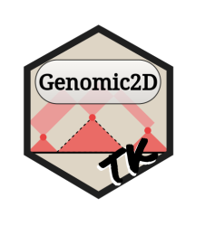

<!-- README.md is generated from README.Rmd. Please edit that file -->

```{r, include = FALSE}
knitr::opts_chunk$set(
  collapse = TRUE,
  comment = "#>",
  fig.path = "man/figures/README-",
  out.width = "100%"
)
```

# Genomic2DTK <a href='https://nchanard.github.io/Genomic2DTK/'></a>

<!-- badges: start -->
[](https://github.com/NChanard/Genomic2DTK/actions/workflows/R-CMD-check.yaml)
[](https://app.codecov.io/gh/NChanard/Genomic2DTK?branch=master)
<!-- badges: end -->

Genomic2DTK is a set of genomic interaction analysis tools.

## Installation

You can install the development version of Genomic2DTK from [GitHub](https://github.com/) with:

``` r
remotes::install_github("NChanard/Genomic2DTK")
```

## Documentation  

[Genomic2DTK](https://nchanard.github.io/Genomic2DTK/)
