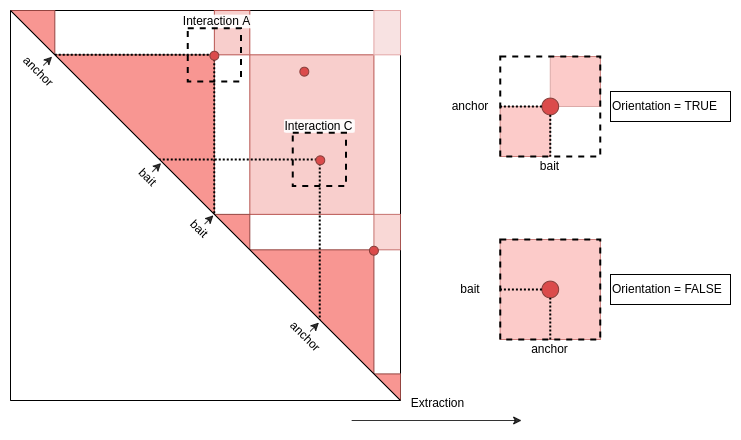

<style>
body {
text-align: justify}
</style>
```{css, echo=FALSE}
pre {
  max-height: 300px;
  overflow-y: auto;
}

pre[class] {
  max-height: 300px;
}
```
```{css, echo=FALSE}
.scroll-100 {
  max-height: 100px;
  overflow-y: auto;
  background-color: inherit;
}
```
```{r, echo = FALSE, message = FALSE}
knitr::opts_chunk$set(collapse = T, comment = "#>")
options(tibble.print_min = 4L, tibble.print_max = 4L)
```


# Firsts Steps
```{r, eval = FALSE}
devtools::install_github("Nchanard/Genomic2DTK")
devtools::install_github("Nchanard/GenomicED")
```

___  
# Loads

## Library
```{r, eval = TRUE}
library(Genomic2DTK)
library(GenomicED)
```

## Data
Here we will load some testing data from sequencing in *Drosophila Melanogaster* on chromosomes 2L and 2R.  

### HiC_ctrl.gnp
HiC data in control condition (depletion of Luc protein) in Pairs GRanges (bedpe) format and with 1KBp resolution.
```{r, eval = TRUE}
data("HiC_ctrl.gnp")
```
<details>  
<summary>View</summary>  
```{r, echo = FALSE, eval = TRUE, message = FALSE}
HiC_ctrl.dtf <- HiC_ctrl.gnp |> as.data.frame() |> head(n=3L)
knitr::kable(HiC_ctrl.dtf[,-c(4,9)],
  col.names = c(
    "seq","start","end","strand",
    "seq","start","end","strand",
    "name","score"),
  align  = "rcccrccccc",
  digits = 1
  ) |>
  kableExtra::add_header_above(c("First" = 4, "Second" = 4, "Metadata"=2))
```
</details>  

### HiC.gnp
HiC data under Beaf-32 depletion condition in Pairs GRanges (bedpe) format and with 1Kbp resolution.  
```{r, eval = TRUE}
data("HiC.gnp")
```
<details>  
<summary>View</summary>
```{r, echo = FALSE, eval = TRUE, message = FALSE}
HiC.dtf <- HiC.gnp |> as.data.frame() |> head(n=3L)
knitr::kable(HiC.dtf[,-c(4,9)],
  col.names = c(
    "seq","start","end","strand",
    "seq","start","end","strand",
    "name","score"),
  align  = "rcccrccccc",
  digits = 1
  ) |>  
  kableExtra::add_header_above(c("First" = 4, "Second" = 4, "Metadata"=2))
```
</details>  

### anchors_Peaks.gnr  
ChIPseq data of Beaf-32 protein in wild type condition in GRanges format (bed).  
```{r, eval = TRUE}
data("anchors_Peaks.gnr")
```
<details>  
<summary>View</summary>  
```{r, echo = FALSE, eval = TRUE, message = FALSE}
anchors_Peaks.dtf <- anchors_Peaks.gnr |> as.data.frame() |> head(n=3L)
anchors_Peaks.dtf <- anchors_Peaks.dtf[,-c(4)]
knitr::kable(anchors_Peaks.dtf[,c(1:4,6,5)],
  col.names = c(
    "seq","start","end","strand",
    "name","score"),
  align  = "rccccc",
  digits = 1
)
```
</details>  

### domains.gnr
Data from TAD calling on HIC data in wild type ([F. Ramirez, 2018](https://doi.org/10.1038/s41467-017-02525-w)).  
```{r, eval = TRUE}
data("domains.gnr")
```
<details>  
<summary>View</summary>  
```{r, echo = FALSE, eval = TRUE, message = FALSE}
domains.dtf <- domains.gnr |> as.data.frame() |> head(n=3L)
domains.dtf <- domains.dtf[,-c(4)]
knitr::kable(domains.dtf[,c(1:4,7,5,6)],
  col.names = c(
    "seq","start","end","strand",
    "name","score","class"),
  align  = "rcccccc"
  )
```
</details>  

### baits_Peaks.gnr
Data from the UCSC data base.  
```{r, eval = TRUE}
data("baits_Peaks.gnr")
```
<details>
<summary>View</summary>
```{r, echo = FALSE, eval = TRUE, message = FALSE}
baits_Peaks.dtf <- baits_Peaks.gnr |> as.data.frame() |> head(n=3L)
baits_Peaks.dtf <- baits_Peaks.dtf[,-c(4)] 
knitr::kable(baits_Peaks.dtf[,c(1:4,6,5)],
  col.names = c(
    "seq","start","end","strand",
    "name","class"),
  align  = "rccccc"
)
```
</details>  

## Genomic Informations
We complete the data with 2L and 2R chromosome sizes and HiC map resolution.
```{r, eval = TRUE}
seqlengths.num <- c('2L'=23513712, '2R'=25286936)
chromSize.dtf  <- data.frame(
  seqnames   = names(seqlengths.num ), 
  seqlengths = seqlengths.num
  )
binSize.num <- 1000
```
___
# Convert HiC bedpe

## HiC Control
```{r, eval = TRUE}
HiC_ctrl.cmx_lst <- GnpToCm(
  hic.gnp       = HiC_ctrl.gnp,
  res.num       = binSize.num,
  chromSize.dtf = chromSize.dtf,
  cores.num     = 1,
  verbose.bln   = FALSE
  )
```

## HiC under Beaf depletion
```{r, eval = TRUE}
HiC.cmx_lst  <- GnpToCm(
  hic.gnp       = HiC.gnp,
  res.num       = binSize.num,
  chromSize.dtf = chromSize.dtf,
  cores.num     = 1,
  verbose.bln   = FALSE
  )
```

## Understand results
The result is a named list of Contactmatrix object where the matrix are dgCMatrix object (sparse matrix). Each element of the list corresponds to the interaction between two sequences (chromosomes). The name of each element corresponds to the names of the two sequences. For exemple, an element that would be named 2L_2R would correspond to the interaction of the 2L and 2R sequences.  
```{r, eval = TRUE}
HiC_ctrl.cmx_lst[1:2]
#>
```
```{r, eval = TRUE}
class(HiC_ctrl.cmx_lst[["2L_2L"]]@matrix)
#>
```
```{r, eval = TRUE}
str(HiC_ctrl.cmx_lst[["2L_2L"]]@matrix)
#>
```
See [InteractionSet](https://www.bioconductor.org/packages/release/bioc/vignettes/InteractionSet/inst/doc/interactions.html) package for more details on ContactMatrix objects and see [Matrix](https://cran.r-project.org/web/packages/Matrix/Matrix.pdf) package for more details on sparse matrices formats.  
If the element name is 2L_2R so, the Bin that make up the 2L and 2R sequences would be represented on the contact map (sparse matrix) by lines and columns respectively.  
```{r, eval = FALSE}
HiC_ctrl.cmx_lst[["2L_2L"]]@matrix[101:110,101:110]
```
<details>  
<summary>View</summary>  
```{r, echo = FALSE, eval = TRUE}
HiC_ctrl.cmx_lst[["2L_2L"]]@matrix[101:110,101:110] |>
  as.matrix() |>
  as.data.frame() |>
  `colnames<-`(paste0("bin ",101:110)) |>
  `row.names<-`(paste0("bin ",101:110)) |>
  knitr::kable(align = "cccccccccc", digits = 1)
```
</details>  

Then the list have some attributes.  
```{r, eval = TRUE}
attributes(HiC_ctrl.cmx_lst)
#>
```
And each element have metadata.  
```{r, eval = TRUE}
S4Vectors::metadata(HiC_ctrl.cmx_lst[["2L_2L"]])
#>
```
1. **resolution** : the resolution of the HiC map.  
2. **chromSize** : the size of the chromosomes in the tibble format.   
    - *seqnames* : the sequence name (chromosome name).  
    - *seqlengths* : the sequence length in base pairs.  
    - *dimension* : the sequence length in base bins  
3. **matricesKind** : the kind of matrix that composes the list in the tibble format.   
    - *name* : the matrix name. 
    - *type* : the interaction kind. *"Cis"* for interactions on the same sequence and *"Trans"* for interactions on different sequences.  
    - *kind* : the matrix kind. U for upper triangle matrices, L for lower triangle matrices, NA for rectangular or square matrices. See  
    - *symmetric* : a boolean that indicates whether the matrix is symmetric (lower triangle identical to upper triangle).  
  
___
# Genomic Features Indexing  

## Tips
1. Put GRanges in a list allow to name the features. Here we name the feature *"Beaf"*.  
2. If no regions constraint are used, chromosomes are used as constraints.  
3. If multiples ranges are in a same bin you can choose variables (`variablesName.chr_vec`) that will be summary with a function (`method.chr`).  

## Indexing

### Anchors (Beaf32)
```{r, message = FALSE, eval = TRUE}
anchors_Index.gnr <- IndexFeatures(
  gRange.gnr_lst        = list(Beaf=anchors_Peaks.gnr), 
  constraint.gnr        = domains.gnr,
  chromSize.dtf         = chromSize.dtf,
  binSize.int           = binSize.num,
  method.chr            = "max",
  variablesName.chr_vec = "score",
  # cores.num             = 1,
  verbose.bln           = FALSE
  )
```
<details>  
<summary>View</summary>  
```{r, echo = FALSE, eval = TRUE}
anchors_Index.gnr |>
  as.data.frame() |>
  head(n=3) |>
  knitr::kable()
```
</details>  

### Baits (Transcription Starting Sites)
```{r, eval = TRUE}
baits_Index.gnr <- IndexFeatures(
  gRange.gnr_lst        = list(Tss=baits_Peaks.gnr),
  constraint.gnr        = domains.gnr,
  chromSize.dtf         = chromSize.dtf,
  binSize.int           = binSize.num,
  method.chr            = "max",
  variablesName.chr_vec = "score",
  cores.num             = 1,
  verbose.bln           = FALSE 
  )
```
<details>  
<summary>View</summary>  
```{r, echo = FALSE, eval = TRUE}
baits_Index.gnr |>
  as.data.frame() |>
  head(n=3) |>
  knitr::kable()
```
</details>  
Then we select only baits (TSS) with no anchors (Beaf) peak on same Bin.
```{r, eval = TRUE}
non_Overlaps.ndx <- SuperTK::NotIn(baits_Index.gnr$bin,anchors_Index.gnr$bin)
baits_Index.gnr <- baits_Index.gnr[non_Overlaps.ndx,]
```
<details>  
<summary>View</summary>  
```{r, echo = FALSE, eval = TRUE}
baits_Index.gnr |>
  as.data.frame() |>
  head(n=3) |>
  knitr::kable()
```
</details>  

___
# Search Pairs 

## Tips
1. if `indexBait.gnr` is NULL the function considers it to be equal to `indexAnchor.gnr`.
2. You could search pairs of feature that are between an certain distances. This selection can also be made on the resulting GInteraction object with the `FilterInteraction` function.

## Pairing
Now we have two genomic features indexed on genome and we want search all putative Beaf-TSS pairs that share a same constraint (i.e: that are in the same Tad). The first element of the pair (beaf) is called **Anchors** and the second one (TSS) is called **Bait**. So a pair is always in order **Anchors-Bait** (as A is before B).
```{r, eval = TRUE}
interactions.gni <- SearchPairs(
    indexAnchor.gnr = anchors_Index.gnr,
    indexBait.gnr   = baits_Index.gnr,
    minDist.num     = NULL, 
    maxDist.num     = NULL,
    cores.num       = 1,
    verbose.bln     = FALSE
    )
```

<details>  
<summary>View</summary>  
```{r, eval = TRUE,  echo = FALSE}
interactions.dtf <- interactions.gni |>
  as.data.frame() |>
  head(n=3L)
interactions.dtf <- interactions.dtf[,-c(4,5,9,10)]
interactions.dtf[,c(1:11,13,12,17,16,18,15,14,20,19,21)] |>
  knitr::kable(
    col.names = c(
      "seq","start","end",
      "seq","start","end",
      "name", "constraint" ,"distance", "orientation", "submatrix.name",
      "name", "bin", "Beaf.name", "Beaf.score", "Beaf.bln",
      "name", "bin", "Tss.name", "Tss.class", "Tss.bln"
    ),
    align  = "rccrccccccccccccccccc",
    digits = 1
  ) |>
  kableExtra::add_header_above(c(
    "Names" = 1,
    "First" = 3,
    "Second" = 3,
    "Interaction"=5,
    "Anchor"=5,
    "Bait"=5)
  ) |>
  kableExtra::add_header_above(c("Ranges" = 7 , "Metadata"=15))
```
</details>

___
# Extractions

## Tips
1. If `res.num` is null, the function find it in the resolution attribute of `hic.cmx_lst`.
2. In `feature.gn` if each ranges overlap with just one Bin, i.e start and end of a GRanges or first and second element of a GInteraction (or GRanges Pairs) are in the same bin, so reference point is automatically `"pf"`.

## Genomic Regions or Domains
On an HiC map, a genomic region is defined by a square (or a triangle if the matrice is triangular) along the diagonal of the Map, resulting in an extraction of square matrices where there diagonal are the diagonal of the HiC map. As not all regions have the same length, the extracted matrices do not have the same dimensions. These extracted matrices are therefore resized by the function.  
```{r, eval = TRUE, echo = FALSE}
knitr::include_graphics("images/Extractions_of_Regions.png")
```
  
### Regions defined with GInteraction object or Pairs GRanges  
The region's start is defined by the center of the first element and the region's end by the center of the second element.  
```{r, eval = TRUE, echo = FALSE}
knitr::include_graphics("images/Regions_GInteractions.png")
```

```{r, eval = TRUE}
interactions_RFmatrix_ctrl.lst  <- ExtractSubmatrix(
  feature.gn         = interactions.gni,
  hic.cmx_lst        = HiC_ctrl.cmx_lst,
  res.num            = NULL,
  referencePoint.chr = "rf",
  matriceDim.num     = 101,
  cores.num          = 1,
  verbose.bln        = FALSE
  )
```

### Regions defined with GRanges
The regions are directly defined by the ranges of GRanges object.  

```{r, eval = TRUE, echo = FALSE}
knitr::include_graphics("images/Regions_GRanges.png")
```
  
```{r, eval = FALSE}
domains_RFmatrix.lst <- ExtractSubmatrix(
  feature.gn         = domains.gnr,
  hic.cmx_lst        = HiC_ctrl.cmx_lst,
  referencePoint.chr = "rf",
  matriceDim.num     = 101,
  cores.num          = 1,
  verbose.bln        = FALSE
  )
```

## Long range interactions
As we move away from the diagonal of the HiC map we have access to long range interactions that we can extract with more or less distant surrounding interactions resulting in an extraction of a square matrices centred on long range interactions.  

```{r, eval = TRUE, echo = FALSE}
knitr::include_graphics("images/Extractions_of_LRI.png")
```

### Interactions defined with GInteraction or Pairs GRanges.
In extracted matrices, the middle of Y axis correspond to the center of the first element and interact with the center of second element in the middle of X axis.  

```{r, eval = TRUE, echo = FALSE}
knitr::include_graphics("images/LRI_GInteractions.png")
```

```{r, eval = FALSE}
interactions_PFmatrix.lst <- ExtractSubmatrix(
  feature.gn         = interactions.gni,
  hic.cmx_lst        = HiC_ctrl.cmx_lst,
  referencePoint.chr = "pf",
  matriceDim.num     = 41,
  cores.num          = 1,
  verbose.bln        = FALSE
  )
```

### Interactions defined with GRanges.
The middle of Y axis correspond to the start of the range and interact with the middle of X axis which correspond with the ends of the ranges.  

```{r, eval = TRUE, echo = FALSE}
knitr::include_graphics("images/LRI_GRanges.png")
```
```{r, eval = TRUE}
domains_PFmatrix.lst <- ExtractSubmatrix(
  feature.gn         = domains.gnr,
  hic.cmx_lst        = HiC_ctrl.cmx_lst,
  referencePoint.chr = "pf",
  matriceDim.num     = 41,
  cores.num          = 1,
  verbose.bln        = FALSE
  )
```

## Ponctual interactions along diagonal.
Here we want to extract fixed windows along the diagonal center on some points (Bins).
```{r, eval = TRUE, echo = FALSE}
knitr::include_graphics("images/Extractions_of_Ponctuals_Interactions.png")
```

### Define ponctual interactions.
First, we want to create objects of points interaction along diagonal. For exemple and to achieve this we will take all the domains borders. The width of each ranges is put to 1 to force the start and end of ranges to be in a same bin.
```{r, eval = TRUE}
domains_Border.gnr <- c(
    GenomicRanges::resize(domains.gnr, 1, "start"),
    GenomicRanges::resize(domains.gnr, 1,  "end" )
) |>
sort()
```
Probably some end of domains are found next to some beginning of other domains. In other words, these genomic locations are found on the same bin.  
```{r, eval = FALSE}
domains_Border.gnr
```
Below ranges 2 and 3 are in this case.  
<details>  
<summary>View</summary>  
```{r, eval = TRUE, echo = FALSE}
domains_Border.dtf <- domains_Border.gnr |>
  as.data.frame() |>
  head(n=3L)
domains_Border.dtf <- domains_Border.dtf[,-c(4)]
knitr::kable(domains_Border.dtf[,c(1:4,7,5,6)],
  col.names = c(
    "seq","start","end","strand",
    "name","score", "class"),
  align  = "rcccccc"
) 
```
</details>  
If we use `GenomicRanges::reduce` function we lost metadata.
```{r, eval = FALSE}
GenomicRanges::reduce(domains_Border.gnr)
```
<details>  
<summary>View</summary>  
```{r, eval = TRUE, echo = FALSE}
domains_Border.dtf <- GenomicRanges::reduce(domains_Border.gnr) |> as.data.frame() |> head(n=3L)
knitr::kable(domains_Border.dtf[,-c(4)],
  col.names = c(
    "seq","start","end","strand"),
  align  = "rcccc"
  ) 
```
</details>  
So we can Bin the GRanges with the `GenomicTK::BinGRanges` function at the HiC Resolution to keep metadata.
```{r, eval = TRUE}
domains_Border_Bin.gnr <- GenomicTK::BinGRanges(
  gRange.gnr  = domains_Border.gnr,
  binSize.int = binSize.num,
  verbose.bln = FALSE
  )
```

Here we see that we conserve metadata and in Bin 2L:95 we have Tad_1 and Tad_2.
```{r, eval = FALSE}
domains_Border_Bin.gnr
```
<details>  
<summary>View</summary>  
```{r, eval = TRUE, echo = FALSE}
domains_Border_Bin.dtf <- domains_Border_Bin.gnr |>
  as.data.frame() |>
  head(n=3L)
domains_Border_Bin.dtf <- domains_Border_Bin.dtf[,-c(4)]
knitr::kable(domains_Border_Bin.dtf[,c(1:4,7,5,6)],
  col.names = c(
    "seq","start","end","strand",
    "name","score", "class"),
  align  = "rcccccc"
  ) 
```
</details>  

In addition, Tad_1 is in Bin 2L:74 and 2L:95, So we need to put an unique name to each ranges (=bin) and keep Tad names in a new variables.
```{r, eval = TRUE}
domains_Border_Bin.gnr$subname <- domains_Border_Bin.gnr$name
domains_Border_Bin.gnr$name    <- domains_Border_Bin.gnr$bin
```

<details>  
<summary>View</summary>  
```{r, eval = TRUE, echo = FALSE}
domains_Border_Bin.dtf <- domains_Border_Bin.gnr |>
  as.data.frame() |>
  head(n=3L)
domains_Border_Bin.dtf <- domains_Border_Bin.dtf[,-c(4)]
knitr::kable(domains_Border_Bin.dtf[,c(1:4,7,5,6,8,9)],
  col.names = c(
    "seq","start","end","strand",
    "name","score", "class","bin","subname"),
  align  = "rcccccccc"
  ) 
```
</details>  
Now we have a GRanges object. And for the exemples below we will need the same informations but in an GInteraction object.  

```{r, eval = TRUE}
domains_Border_Bin.gni <- InteractionSet::GInteractions(domains_Border_Bin.gnr,domains_Border_Bin.gnr)
```

<details>  
<summary>View</summary>  
```{r, eval = TRUE, echo = FALSE}
domains_Border_Bin.dtf <- domains_Border_Bin.gni |>
  as.data.frame() |>
  head(n=3L)
domains_Border_Bin.dtf <- domains_Border_Bin.dtf[,-c(4,5,9,10)]
domains_Border_Bin.dtf[,c(1,2,3,9,7,8,10,11,4,5,6,14,13,12,15,16)] |>
  knitr::kable(
    col.names = c(
      "seq","start","end","name","score", "class", "bin", "subname",
      "seq","start","end","name","score", "class", "bin", "subname"
    ),
    align  = "rccrccccccccccccccccc",
    digits = 1
  ) |>
  kableExtra::add_header_above(c("First" = 8, "Second" = 8))
```
</details>  

### Ponctual interactions defined with GRanges
Here the start and the end of each ranges are in a same bin.  

```{r, eval = TRUE, echo = FALSE}
knitr::include_graphics("images/Ponctuals_Interactions_GRanges.png")
```

```{r, eval = FALSE}
border_PFmatrix.lst <- ExtractSubmatrix(
  feature.gn         = domains_Border_Bin.gnr,
  hic.cmx_lst        = HiC_ctrl.cmx_lst,
  referencePoint.chr = "pf",
  matriceDim.num     = 101,
  verbose.bln        = FALSE
)
```

### Ponctual interactions defined with GInteractions
Here the first element (blue on scheme) is in the same bin as the second (red on scheme).  

```{r, eval = TRUE, echo = FALSE}
knitr::include_graphics("images/Ponctuals_Interactions_GInteractions.png")
```
```{r, eval = FALSE}
border_PFmatrix.lst <- ExtractSubmatrix(
  feature.gn         = domains_Border_Bin.gni,
  hic.cmx_lst        = HiC_ctrl.cmx_lst,
  referencePoint.chr = "pf",
  matriceDim.num     = 101,
  verbose.bln        = FALSE
)
```

___
# Filtrations
In this section we will see how to select interactions in GInteraction object or in matrices in extracted Matrices list.  

## Tips  

1. Filter an GInterction object allow to cross the selection indices as you want.  
2. Filter a matrices list without selection is better than filter the interaction attributes of the matrices list


## Target list
Target list must have a particular structure. First it is a named list. Each name of each element must be the name of column in the GInteraction that you want filter (or in the attributes "interactions" of the matrices list you want filter. Then each element must be a character list to match to this column or a function that will test each row in the column and return a bolean.  

```{r, eval = FALSE}
structureTarget.lst <- list(
  first_colname_of_GInteraction  = c("value"),
  second_colname_of_GInteraction = function(eachElement){min_th<value && value<max_th}
  )
```
First, let's look the GInteractions columns names (metadata of interactions attributes of our matrices list)
```{r, eval = FALSE}
names(S4Vectors::mcols(attributes(interactions_RFmatrix_ctrl.lst)$interactions))
```
Here a look of 
```{r, eval = FALSE}
attributes(interactions_RFmatrix_ctrl.lst)$interactions
```
<details>  
<summary>View</summary>  
```{r, eval = TRUE, echo = FALSE}
interactions_RFmatrix_ctrl.dtf <- attributes(interactions_RFmatrix_ctrl.lst)$interactions |>
  as.data.frame() |>
  head(n=10L)
interactions_RFmatrix_ctrl.dtf <- interactions_RFmatrix_ctrl.dtf[,-c(4,5,9,10)]
interactions_RFmatrix_ctrl.dtf[,c(1:11,13,12,17,16,18,15,14,20,19,21)] |>
  knitr::kable(
    col.names = c(
      "seq","start","end",
      "seq","start","end",
      "name", "constraint" ,"distance", "orientation", "submatrix.name",
      "name", "bin", "Beaf.name", "Beaf.score", "Beaf.bln",
      "name", "bin", "Tss.name", "Tss.class", "Tss.bln"
    ),
    align  = "rccrccccccccccccccccc",
    digits = 1
  ) |>
  kableExtra::add_header_above(c(
    "Names"=1,
    "First" = 3,
    "Second" = 3,
    "Interaction"=5,
    "Anchor"=5,
    "Bait"=5)
  ) |>
  kableExtra::add_header_above(c("Ranges" = 7, "Metadata"=15))
```
</details>  

Now lets create a target with:

1. "Beaf32_8" and "Beaf32_15" in **anchor.Beaf.name**
2. "FBgn0031214" and "FBgn0005278" in **bait.Tss.name**  
3. "2L:74_2L:77" in **name**  
4. **distance** exactly equal to 14000 or 3000  

```{r, eval = TRUE}
target.lst <- list(
  anchor.Beaf.name = c("Beaf32_8","Beaf32_15"),
  bait.Tss.name    = c("FBgn0031214","FBgn0005278"),
  name             = c("2L:74_2L:77"),
  distance         = function(columnElement){
    return(14000==columnElement || columnElement == 3000)
    }
  )
```

## Filtration without selection  

When you don't specify any selection ways the function will return all indices for each target in the list. That will allow you to cross the indices to select want you want in a second step.

### GInteraction filtration
```{r, eval = TRUE}
FilterInteractions(
  interarctions.gni = attributes(interactions_RFmatrix_ctrl.lst)$interactions,
  target.lst        = target.lst,
  selection.fun     = NULL
  ) |>
str()
```
### Matrices list filtration
```{r, eval = TRUE}
FilterInteractions(
  matrices.lst      = interactions_RFmatrix_ctrl.lst,
  target.lst        = target.lst,
  selection.fun     = NULL
  ) |>
str()
```

## Selection Function
Now we will create a function to cross our target indices to select precisely what we want. In order to perform this we will need some set theory basis.  

### Set theory functions
```{r, eval = TRUE}
a <- c("A","B","D","G")
b <- c("E","B","C","G")
c <- c("A","F","C","G")
```
1. Which is common to A, B and C
```{r, eval = TRUE}
Reduce(intersect, list(a,b,c)) |> sort()
intersect(a,b) |> intersect(c) |> sort()
```
2. Which is in A and/or B and/or C
```{r, eval = TRUE}
Reduce(union, list(a,b,c)) |> sort()
union(a,b) |> union(c) |> sort()
```
3. Which is only in A
```{r, eval = TRUE}
Reduce(setdiff,list(a,b,c)) |> sort()
setdiff(a,b) |> setdiff(c) |> sort()
```
4. Which is common in A with B, and not in C
```{r, eval = TRUE}
intersect(a,b) |> setdiff(c) |> sort()
```
5. What is common in A with B, plus all that is present in C
```{r, eval = TRUE}
intersect(a,b) |> union(c) |> sort()
```
6. What is common in C with all elements present in A and B
```{r, eval = TRUE}
union(a,b) |> intersect(c) |> sort()
```
7. Everything that is present in A and B but not in C
```{r, eval = TRUE}
union(a,b) |> setdiff(c) |> sort()
```
8. Which is present only once
```{r, eval = TRUE}
d <- c(a,b,c)
setdiff(d,d[duplicated(d)]) |> sort()
```
                
### Exemple according to the above target
We will select which is in anchor.Beaf.name, bait.Tss.name and distance, but not in name
```{r, eval = TRUE}
selection.fun = function(){
  Reduce(intersect, list(anchor.Beaf.name, bait.Tss.name ,distance) ) |>
  setdiff(name)
  }
```

## Filtration with selection
When you specify a selection way the function will return:

1. The indices according to the selection if you select in interarctions.gni (That allow you to construct a vector to apply to multiple matrices list and there interaction attributes).  
2. The filtred matrices list if you select in matrices list directly and update the attributes.  

### GInteraction filtration  
We want to select wich is in anchor.Beaf.name, bait.Tss.name and distance criterion but not in name.
So, the indices common to anchor.Beaf.name, bait.Tss.name and distance criterions are 1 and 4.
But The indice 1 is in name criterion, so we select only the 4th element

```{r, eval = TRUE}
FilterInteractions(
  interarctions.gni = attributes(interactions_RFmatrix_ctrl.lst)$interactions,
  target.lst        = target.lst,
  selection.fun     = selection.fun
  ) |>
str()
```
names of 4th interaction is:
```{r, eval = TRUE}     
attributes(interactions_RFmatrix_ctrl.lst)$interactions$name[4]
```

### Matrices list filtration
```{r, eval = TRUE}
filtred_interactions_RFmatrix_ctrl.lst <- FilterInteractions(
  matrices.lst  = interactions_RFmatrix_ctrl.lst,
  target.lst    = target.lst,
  selection.fun = selection.fun
  )
```
names of the filtred matrice is the same than the 4th interaction:  

```{r, eval = TRUE}
attributes(filtred_interactions_RFmatrix_ctrl.lst)$names
```

## Particular case: Only one target and no selection
For exemple, we want to filter the 100th first elements, so we target the 100 first names
```{r, eval = TRUE}
first100_target.lst = list(
  submatrix.name = names(interactions_RFmatrix_ctrl.lst)[1:100]
  )
```

### GInteraction filtration
```{r, eval = TRUE}
FilterInteractions(
  interarctions.gni = attributes(interactions_RFmatrix_ctrl.lst)$interactions,
  target.lst        = first100_target.lst,
  selection.fun     = NULL
  ) |> str()
```
### Matrices list filtration
```{r, eval = TRUE}
first100_interactions_RFmatrix_ctrl.lst <- FilterInteractions(
  matrices.lst  = interactions_RFmatrix_ctrl.lst,
  target.lst    = first100_target.lst,
  selection.fun = NULL
  )
attributes(first100_interactions_RFmatrix_ctrl.lst)$interactions
```
A selection of some matrices remove attributes.
```{r, eval = TRUE}
attributes(interactions_RFmatrix_ctrl.lst[1:20])$interactions
```
## Particular case: Sampling
```{r, eval = TRUE}
nSample.num = 3
set.seed(123)
target.lst = list(name=sample(attributes(interactions_RFmatrix_ctrl.lst)$interactions$name,nSample.num))
```
### GInteraction sampling
```{r, eval = TRUE}
FilterInteractions(
  interarctions.gni = attributes(interactions_RFmatrix_ctrl.lst)$interactions,
  target.lst        = target.lst,
  selection.fun     = NULL
  ) |>
str()
```
### Matrices list sampling
```{r, eval = TRUE}
sampled_interactions_RFmatrix_ctrl.lst <- FilterInteractions(
  matrices.lst  = interactions_RFmatrix_ctrl.lst,
  target.lst    = target.lst,
  selection.fun = NULL
  )
attributes(sampled_interactions_RFmatrix_ctrl.lst)$interactions
```

___
# Orientation

## Tips

1. Use the same function to oriente matrices list or only one matrix.  
2. If you want to force orientation on an matrix use orientation only on it, not on a list.  

## Understand orientation
First, lets look how two matrices are oriented (column orientation of metadata of the interactions attribute). Below we can see that the first matrix is correctly oriented (value is TRUE) but not the second one.
```{r, eval = TRUE}
attributes(first100_interactions_RFmatrix_ctrl.lst)$interactions$orientation[13:14] 
```

A matrix that is correctly oriented have an anchor before a bait (see SearchPairs for anchor-bait order), and a matrix that is not oriented have an anchor after a bait.

That mean that:

1. In the first matrice,  the **anchor Beaf is in Y axis** and the **bait   TSS  in X axis**  
2. In the second matrice, the **bait   TSS  is in Y axis** and the **anchor Beaf in X axis**  

```{r, eval = TRUE, echo = FALSE}

```

So we will oriente this second matrix to put anchor on Y axis and bait on X axis and see what happens. 
```{r, eval = TRUE, echo = FALSE}
knitr::include_graphics("images/Orientation.png")
```


## Orientation on matrices list
We expected that the values in upper left corner (green in above scheme) will end up in the lower right corner after orientation, so let's oriente the matrices list according to the orientation metadata.  

```{r, eval = TRUE}
oriented_first100_interactions_RFmatrix_ctrl.lst <- OrienteMatrix(first100_interactions_RFmatrix_ctrl.lst)
```

### First matrice (don't need orientation)  

1. upper left corner **before orientation**.  

```{r, eval = FALSE}
first100_interactions_RFmatrix_ctrl.lst[[13]][1:5,1:5]
```

<details>  
<summary>View</summary>  
```{r, echo = FALSE, eval = TRUE}
first100_interactions_RFmatrix_ctrl.lst[[13]][1:5,1:5] |>
  as.matrix() |>
  as.data.frame() |>
  `colnames<-`(c(1:5)) |>
  `row.names<-`(c(1:5)) |>
  knitr::kable(align = "ccccc", digits = 1)
```
</details>  

  
2. upper left corner **after orientation does not change**.  

```{r, eval = FALSE}
oriented_first100_interactions_RFmatrix_ctrl.lst[[13]][1:5,1:5]
```

<details>  
<summary>View</summary>  
```{r, echo = FALSE, eval = TRUE}
oriented_first100_interactions_RFmatrix_ctrl.lst[[13]][1:5,1:5] |>
  as.matrix() |>
  as.data.frame() |>
  `colnames<-`(c(1:5)) |>
  `row.names<-`(c(1:5)) |>
  knitr::kable(align = "ccccc", digits = 1)
```
</details>  

### Second matrice (need orientation)  

1. upper left corner **before orientation**  

```{r, eval = FALSE}
first100_interactions_RFmatrix_ctrl.lst[[14]][1:5,1:5]
```

<details>  
<summary>View</summary>  
```{r, echo = FALSE, eval = TRUE}
first100_interactions_RFmatrix_ctrl.lst[[14]][1:5,1:5] |>
  as.matrix() |>
  as.data.frame() |>
  `colnames<-`(c(1:5)) |>
  `row.names<-`(c(1:5)) |>
  knitr::kable(align = "ccccc", digits = 1)
```
</details>  

2. **transposed lower right corner after orientation correspond to the upper left corner before orientation**  

```{r, eval = FALSE}
oriented_first100_interactions_RFmatrix_ctrl.lst[[14]][97:101,97:101]
```

<details>  
<summary>View</summary>  
```{r, echo = FALSE, eval = TRUE}
oriented_first100_interactions_RFmatrix_ctrl.lst[[14]][97:101,97:101] |>
  as.matrix() |>
  as.data.frame() |>
  `colnames<-`(c(1:5)) |>
  `row.names<-`(c(1:5)) |>
  knitr::kable(align = "ccccc", digits = 1)
```
</details>  


## Orientation on only one matrice.
The function could also oriente only one matrix but in this case there is no attribute verification so you can oriente a matrix that don't need orentation.

### First matrix  

Transposed lower right corner after orientation correspond to the upper left corner before orientation.  

```{r, eval = FALSE}
OrienteMatrix(first100_interactions_RFmatrix_ctrl.lst[[13]])[97:101,97:101]
```

<details>  
<summary>View</summary>  
```{r, echo = FALSE, eval = TRUE}
OrienteMatrix(first100_interactions_RFmatrix_ctrl.lst[[13]])[97:101,97:101] |>
  as.matrix() |>
  as.data.frame() |>
  `colnames<-`(c(1:5)) |>
  `row.names<-`(c(1:5)) |>
  knitr::kable(align = "ccccc", digits = 1)
```
</details>  

### Second matrix
Below we find again the orientation of the second matrix.  

```{r, eval = FALSE}
OrienteMatrix(first100_interactions_RFmatrix_ctrl.lst[[14]])[97:101,97:101]
```

<details>  
<summary>View</summary>  
```{r, echo = FALSE, eval = TRUE}
OrienteMatrix(first100_interactions_RFmatrix_ctrl.lst[[14]])[97:101,97:101] |>
  as.matrix() |>
  as.data.frame() |>
  `colnames<-`(c(1:5)) |>
  `row.names<-`(c(1:5)) |>
  knitr::kable(align = "ccccc", digits = 1)
```
</details>  

___
# Quantifications
## Tips

1. To print quantifications use `c` function to avoid the attributes printing.  
2. When you select area if is null `operation.fun` return values of the selected area without NA.

## Preregistred area and functions
the `GetQuantif` function have some preregistred area and function (see `Genomic2DTK::GetQuantif`). Below we will extract centrals values. There are interactions values in a square 3x3 centred on the interactions between anchor and bait. With all extracted value we will perform an average after removing all zeros.
```{r, eval = TRUE}
center.num <- GetQuantif(
  matrices.lst  = oriented_first100_interactions_RFmatrix_ctrl.lst,
  area.fun      = "center",
  operation.fun = "mean"
  )
```
Below we can see the values and the attributes of the numerical vector with a value for each matrices. There are same attributes than the matrices list with two news:  

1. **area** that is a function that extract an area of values in each matrices.  
2. **operation** that correspond to the numerical operatiion that is perform on values in the selected area.  

```{r, eval = TRUE}
head(center.num)
```

In order to print quantifications use `c` function to avoid the attributes printing. 
```{r, eval = TRUE}
head(c(center.num))
```

And to reduce the printing use `unlist` function.  
```{r, eval = TRUE}
head(unlist(c(center.num)))
```
## Values naming
With this function you also could named values according to a metadata of the interactions attributes. For exemple we will take same quantification but now we want use the "anchor.Beaf.name" metadata as name.
```{r, eval = TRUE}
namedCenter.num <- GetQuantif(
  matrices.lst  = oriented_first100_interactions_RFmatrix_ctrl.lst,
  area.fun      = "center",
  operation.fun = "mean",
  name.chr      = "anchor.Beaf.name"
  )
```

The 46th matrix is related to two anchor.Beaf.name
```{r, eval = TRUE, echo = FALSE}
S4Vectors::mcols(attributes(oriented_first100_interactions_RFmatrix_ctrl.lst)$interactions)[45:50,c("name","anchor.Beaf.name")] |>
  `row.names<-`(45:50) |>
  knitr::kable(align = "cc", digits = 1)
```

So the value in center.num is repeted in  namedCenter.num
```{r, eval = TRUE}            
unlist(c(center.num))[45:50]
unlist(c(namedCenter.num))[45:51]
```

An attributes is add to know wich values are a duplicate. Here is the second value
```{r, eval = TRUE}
attributes(center.num)$duplicated
attributes(namedCenter.num)$duplicated
```

## Custom functions
The `GetQuantif` function could also take custom **area** selection and **operation** in parameter. For exemple here we use the functions we see in the attributes **area** and **operation** of the center.num vector. We obtain same result with custom function in parameter.
```{r, eval = TRUE}
GetQuantif(
  matrices.lst  = oriented_first100_interactions_RFmatrix_ctrl.lst,
  area.fun      = function(matrice.mtx){matrice.mtx[33:35,67:69]},
  operation.fun = function(area.mtx){
    area.mtx[which(area.mtx==0)]<-NA;
    return(mean(area.mtx,na.rm=TRUE))
    }
  ) |>
c() |>
unlist() |>
head()
```
## Particular cases: Extraction of values
The Operation.fun parameter could a custom function that just return the area selected. this allow to extract values in each matrices.
### One value extraction
```{r, eval = TRUE}
GetQuantif(
  matrices.lst  = oriented_first100_interactions_RFmatrix_ctrl.lst,
  area.fun      = function(matrice.mtx){matrice.mtx[5,5]},
  operation.fun = function(area.mtx){area.mtx}
  ) |>
c() |>
unlist() |>
head()
```
### Area extraction
The Operation.fun parameter could a custom function that just return the area selected. this allow to extract values in each matrices.
```{r, eval = TRUE}
GetQuantif(
  matrices.lst  = oriented_first100_interactions_RFmatrix_ctrl.lst,
  area.fun      = function(matrice.mtx){matrice.mtx[4:6,4:6]},
  operation.fun = function(area){area}
  ) |>
c() |> head()
```
If is null operation.fun return values of the selected area without NA.
```{r, eval = TRUE}
GetQuantif(
  matrices.lst  = oriented_first100_interactions_RFmatrix_ctrl.lst,
  area.fun      = function(matrice.mtx){matrice.mtx[4:6,4:6]},
  operation.fun = NULL
  ) |>
c() |>
head()
```

___
# Aggregations

## Tips

1. When you perform a classical aggregation, you could use any of `matrices.lst` or `ctrlMatrices.lst` parameters
2. If `rm0.bln` is `TRUE` all zeros in matrices list are replace by NA. 
3. This Function keep attributes of the matrices list and add some news:
  * totalMatrixNumber: The total number of matrices.  
  * filteredMatrixNumber: The number of matrices that use for aggregate (after distance filtering).  
  * minimalDistance: The minimal distance between anchor and bait need to keep a matrix before aggregation.  
  * maximalDistance: The maximal distance between anchor and bait need to keep a matrix before aggregation.  
  * aggregationMethod: The function apply to each pixel to obtain the aggregation.  
  * zeroRemoved: A Boolean that indicate if zeros have been replaced by NA.  

When you perfomr differential aggregation there are some supplementary attributes.  

  * correctedFact: The value that is add to the condition to delete some noise. It's compute by the median difference between condition and control in an background area (e.g upper right corner in matrices).
  * matrices:  The list of matrices.  
    - agg: Aggregation of the condition.  
    - aggCtrl: Aggregation of the control.  
    - aggCorrected: Aggregation of the condition corrected with correctedFact.  
    - aggDelta: the difference between the aggregated matrix of the condition and the aggregated matrix of the control.  
    - aggCorrectedDelta: the difference between the aggregated matrix of the condition corrected with correctedFact and the aggregated matrix of the control.  
 
## Classic Aggregations

### Preregistered function  
Like the `GetQuantif` function, the aggregation have some preregistred function like `sum`, `mean` or `median`. See Genomic2DTK::Aggregation for more details.
```{r, eval = TRUE}
agg_sum.mtx <- Aggregation(
  matrices.lst = oriented_first100_interactions_RFmatrix_ctrl.lst, 
  agg.fun      = "sum",
  rm0.bln      = FALSE
  )
```

Verification with extraction of one value  
```{r, eval = TRUE}
agg_sum.mtx[5,5]
```
```{r, eval = TRUE}
GetQuantif(
  matrices.lst = oriented_first100_interactions_RFmatrix_ctrl.lst,
  area.fun     = function(matrice.mtx){matrice.mtx[5,5]},
  operation.fun = function(area.num){area.num}
  ) |>
unlist() |>
sum(na.rm=TRUE)
```                
                
### Custom function  
Here we will used a custom function. This function must return an unique value for all pixels_ij of the matrices.
```{r, eval = TRUE}
agg_mean.mtx <- Aggregation(
  matrices.lst = oriented_first100_interactions_RFmatrix_ctrl.lst,
  agg.fun      = function(x){mean(x,na.rm=TRUE)}
  )
```
Verification with extraction of one value
```{r, eval = TRUE}
agg_mean.mtx[5,5]
```
```{r, eval = TRUE}
GetQuantif(
  matrices.lst = oriented_first100_interactions_RFmatrix_ctrl.lst,
  area.fun     = function(matrice.mtx){matrice.mtx[5,5]},
  operation.fun = function(area.num){area.num}
  ) |>
unlist() |>
mean(na.rm=TRUE)
```
                
### Distance constraint  
You could add distance constraint, in this case the function will agregate all matrices that have a distance between anchor and bait superior or equal to the `minDist` parameter and inferior or equal to the `maxDist` parameter
```{r, eval = TRUE}
agg_dist.mtx <- Aggregation(
  matrices.lst = oriented_first100_interactions_RFmatrix_ctrl.lst,
  minDist      = 9000,
  maxDist      = 11000,
  agg.fun      = "sum"
  )
```
Verification with extraction of one value
```{r, eval = TRUE}
agg_dist.mtx[5,5]
quantif.num <- GetQuantif(
  matrices.lst = oriented_first100_interactions_RFmatrix_ctrl.lst,
  area.fun     = function(matrice.mtx){matrice.mtx[5,5] },
  operation.fun = function(area.num){area.num}
  )
ndx <- which(
  attributes(quantif.num)$interactions$distance >= 9000 &
  attributes(quantif.num)$interactions$distance <= 11000
  )
sum(unlist(quantif.num)[ndx],na.rm=TRUE)
```
                
## Differential Aggregation
With the `Aggregation` function you also could perform differential aggregation. There is two kind of differential that the function perform:

1. The canonical differences where the difference is perform at each matrix level, i.e the function perform the difference of matrices that have the same name in the two list and then aggregate the differential matrices list.  
2. The second kind of differential is at the aggregated level, i.e the function perform the aggregation of the two condition at this step it's possible to perform a correction to avoid noise on the aggregated matrix by adding a correction factor calculated in an background area (e.g upper right corner in matrices). Then the function perform the difference of the two aggregated and possibly corrected matrices. This second kind is store in attributes and is called **DeltaAggregated**.  

When the number of matrices is not too high (few hundreds) you may want perform statistical test (Warning it's very memmory conssuming).

### Preparation of matrices list
             
1. Preparation of Control matrices list condition  
**Filtration**
```{r, eval = FALSE}
first100_target.lst = list(
  submatrix.name = names(interactions_RFmatrix_ctrl.lst)[1:100]
  )
first100_interactions_RFmatrix_ctrl.lst <- FilterInteractions(
  matrices.lst  = interactions_RFmatrix_ctrl.lst,
  target.lst    = first100_target.lst,
  selection.fun = NULL
  )
```
**Orientation**
```{r, eval = FALSE}
oriented_first100_interactions_RFmatrix_ctrl.lst <- OrienteMatrix(first100_interactions_RFmatrix_ctrl.lst)
```
**Quantifications for Verification**
```{r, eval = TRUE}
quantif_ctrl.num <- GetQuantif(
  matrices.lst  = oriented_first100_interactions_RFmatrix_ctrl.lst,
  area.fun      = function(matrice.mtx){matrice.mtx[5,5]},
  operation.fun = function(area.num){area.num}
  )
```
2. Preparation of second matrices list in Beaf depleted condition.
**Extraction**
```{r, eval = TRUE}
interactions_RFmatrix.lst  <- ExtractSubmatrix(
  feature.gn         = interactions.gni,
  hic.cmx_lst        = HiC.cmx_lst,
  referencePoint.chr = "rf",
  matriceDim.num     = 101,
  verbose            = FALSE
  )
```
**Filtration**  
```{r, eval = TRUE}
first100_interactions_RFmatrix.lst <- FilterInteractions(
  matrices.lst  = interactions_RFmatrix.lst,
  target.lst    = first100_target.lst,
  selection.fun = NULL
  )
```
**Orientation**  
```{r, eval = TRUE}
oriented_first100_interactions_RFmatrix.lst <- OrienteMatrix(first100_interactions_RFmatrix.lst)
```
**Quantifications for Verification**  
```{r, eval = TRUE}
quantif.num <- GetQuantif(
  matrices.lst  = oriented_first100_interactions_RFmatrix.lst,
  area.fun      = function(matrice.mtx){matrice.mtx[5,5]},
  operation.fun = function(area.num){area.num}
  )
```
### Aggregate
```{r, eval = TRUE}
diffAggreg.mtx <- Aggregation(
  ctrlMatrices.lst    = oriented_first100_interactions_RFmatrix_ctrl.lst,
  matrices.lst        = oriented_first100_interactions_RFmatrix.lst,
  minDist             = NULL,
  maxDist             = NULL,
  agg.fun             = "mean",
  rm0.bln             = FALSE,
  diff.fun            = "substraction",
  scaleCorrection.bln = TRUE,
  correctionArea.lst  =  list(
    i = c(1:30),
    j = c(72:101)
    ),
  statCompare.bln = TRUE)
```

### Display Aggregation

1. Print with all attributes  

```{r, eval = FALSE}
diffAggreg.mtx
```

2. Print only matrice  

```{r, eval = FALSE}
prmatrix(diffAggreg.mtx)
diffAggreg.mtx[1:101,1:101]
```

3. Differential at each submatrix level  

```{r, eval = TRUE}
diffAggreg.mtx[5,5]
mean(unlist(quantif.num) - unlist(quantif_ctrl.num))
```            

4. Aggregation of Control  

```{r, eval = TRUE}
attributes(diffAggreg.mtx)$matrices$aggCtrl[5,5]
mean(unlist(quantif_ctrl.num))
```

5. Aggregation of Beaf depleted Condition  

```{r, eval = TRUE}
attributes(diffAggreg.mtx)$matrices$agg[5,5]
mean(unlist(quantif.num))
```

6. Differential at Aggregated level  

```{r, eval = TRUE}
attributes(diffAggreg.mtx)$matrices$agg[5,5]-attributes(diffAggreg.mtx)$matrices$aggCtrl[5,5]
attributes(diffAggreg.mtx)$matrices$aggDelta[5,5]
mean(unlist(quantif.num)) - mean(unlist(quantif_ctrl.num))
```

7. ScaleFactor  

```{r, eval = TRUE}
correctedFact.num = median(attributes(diffAggreg.mtx)$matrices$aggCtrl[1:30,72:101]) - median(attributes(diffAggreg.mtx)$matrices$agg[1:30,72:101])
correctedFact.num
attributes(diffAggreg.mtx)$correctedFact
```

8. Aggregation Classic Scaled  

```{r, eval = TRUE}
attributes(diffAggreg.mtx)$matrices$aggCorrected[5,5]
attributes(diffAggreg.mtx)$matrices$agg[5,5] + correctedFact.num
mean(unlist(quantif.num)) + correctedFact.num
```

9. Differential at Aggregated level between Aggregation Classic Scaled and Control  

```{r, eval = TRUE}
attributes(diffAggreg.mtx)$matrices$agg[5,5]-attributes(diffAggreg.mtx)$matrices$aggCtrl[5,5] + correctedFact.num
attributes(diffAggreg.mtx)$matrices$aggCorrectedDelta[5,5]
mean(unlist(quantif.num)) - mean(unlist(quantif_ctrl.num)) + correctedFact.num
```
# Aggregations plots
## Preparation of aggregated matrices

1. Control aggregation

```{r}
oriented_interactions_RFmatrix_ctrl.lst <- OrienteMatrix(interactions_RFmatrix_ctrl.lst)
aggreg.mtx <- Aggregation(
    ctrlMatrices.lst=oriented_interactions_RFmatrix_ctrl.lst,
    agg.fun="mean",
    rm0.bln=FALSE
)
row.names(aggreg.mtx) = c(rep("",33),rep("*",2),rep("",31),rep("*",2),rep("",33))
colnames(aggreg.mtx) = c(rep("",33),rep("*",2),rep("",31),rep("*",2),rep("",33))
```

2. Differential aggregation

```{r}
oriented_interactions_RFmatrix.lst <- OrienteMatrix(interactions_RFmatrix.lst)
diffAggreg.mtx <- Aggregation(
    ctrlMatrices.lst    = oriented_interactions_RFmatrix_ctrl.lst,
    matrices.lst        = oriented_interactions_RFmatrix.lst,
    minDist             = NULL,
    maxDist             = NULL,
    agg.fun             = "mean",
    rm0.bln             = FALSE,
    diff.fun            = "log2+1",
    scaleCorrection.bln = TRUE,
    correctionArea.lst  = list( i=c(1:30) , j=c(72:101) ),
    statCompare.bln     = TRUE
)
row.names(diffAggreg.mtx) = c(rep("",33),rep("*",2),rep("",31),rep("*",2),rep("",33))
colnames(diffAggreg.mtx) = c(rep("",33),rep("*",2),rep("",31),rep("*",2),rep("",33))
```

## Plots
Below you could see the ggAPA function that create a ggplot object (ggplot2::geom_raster)  

```{r, fig.dim = c(7,7)}
ggAPA(
    apa.mtx   = aggreg.mtx,
    title.chr = "APA"
)
```

### Center
You could center the color scale.
```{r, fig.dim = c(7,7)}
ggAPA(
    apa.mtx    = aggreg.mtx,
    title.chr  = "APA center on 0.2",
    center.num = 0.2
)
```
  
### Trimming  

You could remove a percentage of value choose in upper tail, lower tail or both tails of the distribution.
```{r, fig.dim = c(7,7)}
ggAPA(
    apa.mtx      = aggreg.mtx,
    title.chr    = "APA 30% trimmed on upper side",
    trimPrct.num = 30,
    bounds.chr   = "upper"
)
ggAPA(
    apa.mtx      = aggreg.mtx,
    title.chr    = "APA 30% trimmed on upper side",
    trimPrct.num = 30,
    bounds.chr   = "lower"
)
ggAPA(
    apa.mtx      = aggreg.mtx,
    title.chr    = "APA 30% trimmed",
    trimPrct.num = 30,
    bounds.chr   = "both"
)
```

### MinMax  

You could also define a minimal and/or a maximal value for the color scale. If you use a trimming with this options, the function will choose the more stringent options for each minimal and maximal value. 
```{r, fig.dim = c(7,7)}
ggAPA(
    apa.mtx         = aggreg.mtx,
    title.chr       = "APA [.15-.35]",
    minBoundary.num = 0.15,
    maxBoundary.num = 0.35
)
```

### ColBreaks  

You could define your own color breaks
```{r, fig.dim = c(7,7)}
ggAPA(
    apa.mtx       = aggreg.mtx,
    title.chr     = "APA [.1, .2, .3, .4]",
    colBreaks.num = c(0.1,0.2,0.3,0.4)
)
ggAPA(
    apa.mtx       = aggreg.mtx,
    title.chr     = "APA [.10, .13, .16, .20, .30, .40]",
    colBreaks.num = c(0.1,0.13,0.16,0.2,0.3,0.4)
)
ggAPA(
    apa.mtx       = aggreg.mtx,
    title.chr     = "APA [.10, .20, .30, .33, .36, .40]",
    colBreaks.num = c(0.1,0.2,0.3,0.33,0.36,0.40)
)
```

### Color Scale  

Below we show the effect of the color scale biais.
```{r, fig.dim = c(7,7)}
ggAPA(
    apa.mtx    = aggreg.mtx,
    title.chr  = "APA",
    colorScale = "density"
)
ggAPA(
    apa.mtx     = aggreg.mtx,
    title.chr   = "APA",
    bias.num    = 2
)
ggAPA(
    apa.mtx     = aggreg.mtx,
    title.chr   = "APA",
    bias.num    = 0.5
)
```

### Blurred  

There is an option to apply a blurr on the heatmap that could remove some noise. 
```{r, fig.dim = c(7,7)}
ggAPA(
    apa.mtx           = aggreg.mtx,
    title.chr         = "APA",
    blurPass.num      = 1,
    blurSd.num        = 0.5,
    lowerTri.num = NA
)
```

### Changed color  

here is an option to change the color of heatmap and color of NA values.
```{r, fig.dim = c(7,7)}
ggAPA(
    apa.mtx     = aggreg.mtx,
    title.chr   = "APA",
    heatmap.col = SuperTK::viridis(6),
    na.col      = "black"
)
```

### Modifications  

Because the function  return a ggplot object you could modify the ggplot object with ggplot2.
```{r, fig.dim = c(7,7)}
ggAPA(
    apa.mtx     = aggreg.mtx,
    title.chr   = "APA",
) + 
ggplot2::labs(
    title    = "New title",
    subtitle = "and subtitle"
)
```

## All in one function  

Here is an all in one function that plot the matrix (and all matrices in attributes if it's a differential aggregation) with different options and put it in a pdf. 
```{r, eval = TRUE}
PlotAPA(
    apa.mtx                  = diffAggreg.mtx,
    trimPrct.num             = 20,
    minBoundary.num          = -2,
    center.num               = 0,
    maxBoundary.num          = 2,
    minConditionBoundary.num = 0,
    maxConditionBoundary.num = 2
)
```
