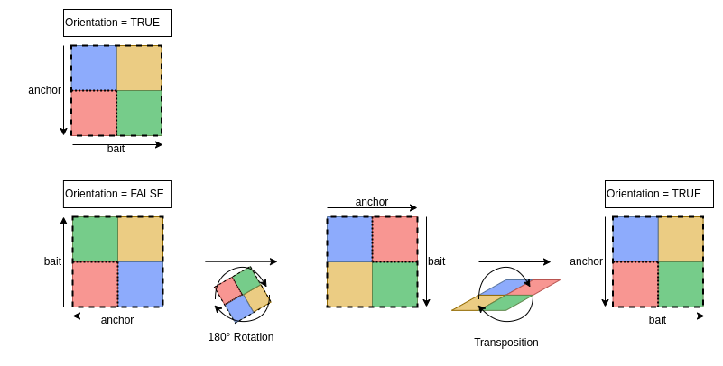

<style>
body {
text-align: justify}
</style>
```{css, echo=FALSE}
pre {
  max-height: 300px;
  overflow-y: auto;
}

pre[class] {
  max-height: 300px;
}
```
```{css, echo=FALSE}
.scroll-100 {
  max-height: 100px;
  overflow-y: auto;
  background-color: inherit;
}
```
```{r, echo = FALSE, message = FALSE}
knitr::opts_chunk$set(collapse = T, comment = "#>")
options(tibble.print_min = 4L, tibble.print_max = 4L)
```

# Library
## Install libraries
```{r, eval = FALSE}
remotes::install_github("NChanard/Genomic2DTK")
remotes::install_github("NChanard/GenomicED")
```

## Load libraries
```{r, eval = TRUE}
library(Genomic2DTK)
library(GenomicED)
```

___  
# Test dataset

Test dataset originates from *Drosophila melanogaster*.
It contains HiC data of chromosomes 2L and 2R in control and BEAF32 KD conditions, a subset of Beaf32 ChIP-seq peaks and a subset of TSS from [TxDb.Dmelanogaster.UCSC.dm6.ensGene](https://bioconductor.org/packages/release/data/annotation/html/TxDb.Dmelanogaster.UCSC.dm6.ensGene.html). 

## HiC test dataset
### HiC_ctrl.gnp
HiC data in control condition (depletion of inexistent Luciferase (Luc) protein) in the GRangePairs format (bedpe) with 1KBp resolution.
```{r, eval = TRUE}
data("HiC_ctrl.gnp")
```

<details>  
<summary>View</summary>  

```{r, echo = FALSE, eval = TRUE, message = FALSE}
  HiC_ctrl.dtf <- HiC_ctrl.gnp |> as.data.frame() |> head(n=3L)
  knitr::kable(HiC_ctrl.dtf[,-c(4,9)],
    col.names = c(
      "seq","start","end","strand",
      "seq","start","end","strand",
      "name","score"),
    align  = "rcccrccccc",
    digits = 1
    ) |>
    kableExtra::add_header_above(c("First" = 4, "Second" = 4, "Metadata"=2))
```
</details>  

### HiC.gnp
HiC data in Beaf-32 depleted condition in the GRangePairs format (bedpe) with 1KBp resolution.
```{r, eval = TRUE}
  data("HiC.gnp")
```
<details>  
<summary>View</summary>
```{r, echo = FALSE, eval = TRUE, message = FALSE}
  HiC.dtf <- HiC.gnp |> as.data.frame() |> head(n=3L)
  knitr::kable(HiC.dtf[,-c(4,9)],
    col.names = c(
      "seq","start","end","strand",
      "seq","start","end","strand",
      "name","score"),
    align  = "rcccrccccc",
    digits = 1
    ) |>  
    kableExtra::add_header_above(c("First" = 4, "Second" = 4, "Metadata"=2))
```
</details>  

## Anchors, baits and constraints: 1D and 2D coordinates test dataset
### ChIP-seq peaks: anchors_Peaks.gnr  
ChIPseq data of Beaf-32 protein in wild type condition in GRanges format (bed).  
```{r, eval = TRUE}
data("anchors_Peaks.gnr")
```
<details>  
<summary>View</summary>  
```{r, echo = FALSE, eval = TRUE, message = FALSE}
anchors_Peaks.dtf <- anchors_Peaks.gnr |> as.data.frame() |> head(n=3L)
anchors_Peaks.dtf <- anchors_Peaks.dtf[,-c(4)]
knitr::kable(anchors_Peaks.dtf[,c(1:4,6,5)],
  col.names = c(
    "seq","start","end","strand",
    "name","score"),
  align  = "rccccc",
  digits = 1
)
```
</details>  


### Reference annontation: baits_Peaks.gnr
Data from the UCSC data base.  
```{r, eval = TRUE}
data("baits_Peaks.gnr")
```
<details>
<summary>View</summary>
```{r, echo = FALSE, eval = TRUE, message = FALSE}
baits_Peaks.dtf <- baits_Peaks.gnr |> as.data.frame() |> head(n=3L)
baits_Peaks.dtf <- baits_Peaks.dtf[,-c(4)] 
knitr::kable(baits_Peaks.dtf[,c(1:4,6,5)],
  col.names = c(
    "seq","start","end","strand",
    "name","class"),
  align  = "rccccc"
)
```
</details>  


### Domains annotation: domains.gnr
Data from TAD calling on HIC data in wild type (bed or bedpe format) ([F. Ramirez, 2018](https://doi.org/10.1038/s41467-017-02525-w)).  
```{r, eval = TRUE}
data("domains.gnr")
```
<details>  
<summary>View</summary>  
```{r, echo = FALSE, eval = TRUE, message = FALSE}
domains.dtf <- domains.gnr |> as.data.frame() |> head(n=3L)
domains.dtf <- domains.dtf[,-c(4)]
knitr::kable(domains.dtf[,c(1:4,7,5,6)],
  col.names = c(
    "seq","start","end","strand",
    "name","score","class"),
  align  = "rcccccc"
  )
```
</details>  


## Additional genome informations
General genomic informations used by the functions all along the process are a data.frame containing chromosomes names and sized and the binSize, corresponding to the HiC matrices resolution.
We complete the data with 2L and 2R chromosome sizes and HiC map resolution.
```{r, eval = TRUE}
seqlengths.num <- c('2L'=23513712, '2R'=25286936)
chromSize.dtf  <- data.frame(
  seqnames   = names(seqlengths.num ), 
  seqlengths = seqlengths.num
  )
binSize.num <- 1000
```
___

# Convert HiC bedpe // this section will be replaced by Import.hic function

## HiC Control
```{r, eval = TRUE}
data(HiC_ctrl.cmx_lst)
```

## HiC under Beaf depletion
```{r, eval = TRUE}
data(HiC.cmx_lst)
```

## HiC data format: Contact matrix list (cmx_lst) structure 
Each element of the list corresponds to a Contactmatrix object (dgCMatrix object, sparse matrix format) storing contact frequencies  for one chromosomes (cis-interactions, ex: "2L_2L") or between two chromosomes (trans-interactions, ex: "2L_2R").  
HiC data format is based on [InteractionSet](https://www.bioconductor.org/packages/release/bioc/vignettes/InteractionSet/inst/doc/interactions.html) package, for more details on sparse matrices format, see [Matrix](https://cran.r-project.org/web/packages/Matrix/Matrix.pdf).
```{r, eval = TRUE}
HiC_ctrl.cmx_lst[1:2]
#>
```
```{r, eval = TRUE}
class(HiC_ctrl.cmx_lst[["2L_2L"]]@matrix)
#>
```
```{r, eval = TRUE}
str(HiC_ctrl.cmx_lst[["2L_2L"]]@matrix)
#>
```
```{r, eval = FALSE}
HiC_ctrl.cmx_lst[["2L_2L"]]@matrix[101:110,101:110]
```
<details>  
<summary>View</summary>  
```{r, echo = FALSE, eval = TRUE}
HiC_ctrl.cmx_lst[["2L_2L"]]@matrix[101:110,101:110] |>
  as.matrix() |>
  as.data.frame() |>
  `colnames<-`(paste0("bin ",101:110)) |>
  `row.names<-`(paste0("bin ",101:110)) |>
  knitr::kable(align = "cccccccccc", digits = 1)
```
</details>  

Acces to Contact matrix list attributes:
```{r, eval = TRUE}
attributes(HiC_ctrl.cmx_lst)
#>
```
Acces to Contact matrix metadata:
```{r, eval = TRUE}
S4Vectors::metadata(HiC_ctrl.cmx_lst[["2L_2L"]])
#>
```
1. **resolution** : the resolution of the HiC map.  
2. **chromSize** : the size of the chromosomes in the tibble format.   
    - *seqnames* : the sequence name (chromosome name).  
    - *seqlengths* : the sequence length in base pairs.  
    - *dimension* : the sequence length in base bins  
3. **matricesKind** : the kind of matrix that composes the list in the tibble format.   
    - *name* : the matrix name. 
    - *type* : interaction type. *"Cis"* for interactions on the same chromosome and *"Trans"* for interactions on different chromosomes.  
    - *kind* : the matrix kind. U for upper triangle matrices, L for lower triangle matrices, NA for rectangular or square matrices. See  
    - *symmetric* : a boolean that indicates whether the matrix is symmetric (lower triangle identical to upper triangle).  
  
___
# Genomic Features Indexing  

## Indexing

### Indexing example 1: Anchors from Beaf32 ChIP-seq binding sites (peak calling output bed file)
```{r, message = FALSE, eval = TRUE}
anchors_Index.gnr <- IndexFeatures(
  gRange.gnr_lst        = list(Beaf=anchors_Peaks.gnr), 
  constraint.gnr        = domains.gnr,
  chromSize.dtf         = chromSize.dtf,
  binSize.num           = binSize.num,
  variablesName.chr_vec = "score",
  method.chr            = "max",
  cores.num             = 1,
  verbose.bln           = FALSE
  )
```
<details>  
<summary>View</summary>  
```{r, echo = FALSE, eval = TRUE}
anchors_Index.gnr |>
  as.data.frame() |>
  head(n=3) |>
  knitr::kable()
```
</details>  

### Indexing example 2: Baits from TSS (transcription start sites reference annotation)
```{r, eval = TRUE}
baits_Index.gnr <- IndexFeatures(
  gRange.gnr_lst        = list(Tss=baits_Peaks.gnr),
  constraint.gnr        = domains.gnr,
  chromSize.dtf         = chromSize.dtf,
  binSize.num           = binSize.num,
  variablesName.chr_vec = "score",
  method.chr            = "max",
  cores.num             = 1,
  verbose.bln           = FALSE 
  )
```
<details>  
<summary>View</summary>  
```{r, echo = FALSE, eval = TRUE}
baits_Index.gnr |>
  as.data.frame() |>
  head(n=3) |>
  knitr::kable()
```
</details>  

## Filter or subset indexed features:
By using features names and bin IDs, it is possible to filter or subset indexed features.
Example: Subset indexed TSS that are not in the same bin than an indexed Beaf32 peak.
```{r, eval = TRUE}
non_Overlaps.ndx <- SuperTK::NotIn(baits_Index.gnr$bin,anchors_Index.gnr$bin)
baits_Index.gnr <- baits_Index.gnr[non_Overlaps.ndx,]
```
<details>  
<summary>View</summary>  
```{r, echo = FALSE, eval = TRUE}
baits_Index.gnr |>
  as.data.frame() |>
  head(n=3) |>
  knitr::kable()
```
</details>  


## Tips
1. It is possible to index multiple features in the same time by submitting a named list of GRanges. Names given in the list of GRanges are then used to filter indexed features and pairs.  
2. If contraint.gnr is set, anchors and baits will be paired when located within the same region only. If contraint.gnr is NULL, chromosomes are used as constraints.  
3. When multiples ranges are in a same bin (ex: 3 ChIP-seq peaks in the same 10kb bin), associated numeric variables in metadata (`variablesName.chr_vec`) can be summarized according to the defined method (`method.chr`), Example: Maximum peak score of the bin is kept in metadata column `score`.  

___

# Search Pairs 

## Pairing
SearchPairs function takes as input one or two indexed features and returns all putative pairs within the same constraint (ex: wihtin the same TAD).
If only one indexed features is set in indexAnchor.gnr, SearchPairs will return symetrical homotypic pairs A<->A, if indexAnchor.gnr and indexBait.gnr are set, it will return asymetrical heterotypic pairs A<->B 

```{r, eval = TRUE}
interactions.gni <- SearchPairs(
    indexAnchor.gnr = anchors_Index.gnr,
    indexBait.gnr   = baits_Index.gnr,
    minDist.num     = NULL, 
    maxDist.num     = NULL,
    cores.num       = 1,
    verbose.bln     = FALSE
    )
```

<details>  
<summary>View</summary>  
```{r, eval = TRUE,  echo = FALSE}
interactions.dtf <- interactions.gni |>
  as.data.frame() |>
  head(n=3L)
interactions.dtf <- interactions.dtf[,-c(4,5,9,10)]
interactions.dtf[,c(1:11,13,12,17,16,18,15,14,20,19,21)] |>
  knitr::kable(
    col.names = c(
      "seq","start","end",
      "seq","start","end",
      "name", "constraint" ,"distance", "orientation", "submatrix.name",
      "name", "bin", "Beaf.name", "Beaf.score", "Beaf.bln",
      "name", "bin", "Tss.name", "Tss.class", "Tss.bln"
    ),
    align  = "rccrccccccccccccccccc",
    digits = 1
  ) |>
  kableExtra::add_header_above(c(
    "Names" = 1,
    "First" = 3,
    "Second" = 3,
    "Interaction"=5,
    "Anchor"=5,
    "Bait"=5)
  ) |>
  kableExtra::add_header_above(c("Ranges" = 7 , "Metadata"=15))
```
</details>


## Tips
1. If `indexBait.gnr` is NULL, SearchPairs will return homotypic pairs with `indexAnchor.gnr`.
2. Minimum and maximum distances between pairs' anchors can be set. Note that it is also possible to filter pairs within a specific distance during following steps.


___
# Extractions

## Case 1: Long-range interactions between two distal anchors.


```{r, eval = TRUE, echo = FALSE}
knitr::include_graphics("images/Extractions_of_LRI.png")
```

### Interactions defined with GInteraction or Pairs GRanges.
In extracted matrices, the middle of Y axis corresponds to the center of the first element and interact with the center of second element in the middle of X axis.  

```{r, eval = TRUE, echo = FALSE}
knitr::include_graphics("images/LRI_GInteractions.png")
```

```{r, eval = FALSE}
interactions_PFmatrix.lst <- ExtractSubmatrix(
  feature.gn         = interactions.gni,
  hic.cmx_lst        = HiC_ctrl.cmx_lst,
  referencePoint.chr = "pf",
  matriceDim.num     = 41,
  cores.num          = 1,
  verbose.bln        = FALSE
  )
```

### Interactions defined with GRanges.
The middle of Y axis corresponds to the start of the range and interact with the middle of X axis which corresponds with the end of the ranges.  

```{r, eval = TRUE, echo = FALSE}
knitr::include_graphics("images/LRI_GRanges.png")
```
```{r, eval = TRUE}
domains_PFmatrix.lst <- ExtractSubmatrix(
  feature.gn         = domains.gnr,
  hic.cmx_lst        = HiC_ctrl.cmx_lst,
  referencePoint.chr = "pf",
  matriceDim.num     = 41,
  cores.num          = 1,
  verbose.bln        = FALSE
  )
```

## Case 2: Interactions around genomic regions or domains.

In this case, extracted matrices are resized and scaled in order to fit all regions to the same number of bins.

```{r, eval = TRUE, echo = FALSE}
knitr::include_graphics("images/Extractions_of_Regions.png")
```
  
### Regions defined with GInteraction object or Pairs GRanges  
The region's start is defined by the center of the first element and the region's end by the center of the second element.  
```{r, eval = TRUE, echo = FALSE}
knitr::include_graphics("images/Regions_GInteractions.png")
```

```{r, eval = TRUE}
interactions_RFmatrix_ctrl.lst  <- ExtractSubmatrix(
  feature.gn         = interactions.gni,
  hic.cmx_lst        = HiC_ctrl.cmx_lst,
  res.num            = NULL,
  referencePoint.chr = "rf",
  matriceDim.num     = 101,
  cores.num          = 1,
  verbose.bln        = FALSE
  )
```

### Regions defined with GRanges
The regions are directly defined by the ranges of GRanges object.  

```{r, eval = TRUE, echo = FALSE}
knitr::include_graphics("images/Regions_GRanges.png")
```
  
```{r, eval = FALSE}
domains_RFmatrix.lst <- ExtractSubmatrix(
  feature.gn         = domains.gnr,
  hic.cmx_lst        = HiC_ctrl.cmx_lst,
  referencePoint.chr = "rf",
  matriceDim.num     = 101,
  cores.num          = 1,
  verbose.bln        = FALSE
  )
```

## Case 3: Interactions along the diagonal.

```{r, eval = TRUE, echo = FALSE}
knitr::include_graphics("images/Extractions_of_Ponctuals_Interactions.png")
```

### Example with TAD:
Step 1: generate a GRanges object of TAD boundaries by concatenating starts and ends of TADs.
```{r, eval = TRUE}
domains_Border.gnr <- c(
    GenomicRanges::resize(domains.gnr, 1, "start"),
    GenomicRanges::resize(domains.gnr, 1,  "end" )
) |>
sort()
```
</details>  

Step 2: Filter and reduce TAD boundaries GRanges object according to HiC resolution (binSize) + Store TAD names.
```{r, eval = TRUE}
domains_Border_Bin.gnr <- GenomicTK::BinGRanges(
  gRange.gnr  = domains_Border.gnr,
  binSize.num = binSize.num,
  verbose.bln = FALSE
  )

domains_Border_Bin.gnr$subname <- domains_Border_Bin.gnr$name
domains_Border_Bin.gnr$name    <- domains_Border_Bin.gnr$bin

```

```{r, eval = FALSE}
domains_Border_Bin.gnr
```
<details>  
<summary>View</summary>  


```{r, eval = TRUE, echo = FALSE}
domains_Border_Bin.dtf <- domains_Border_Bin.gnr |>
  as.data.frame() |>
  head(n=3L)
domains_Border_Bin.dtf <- domains_Border_Bin.dtf[,-c(4)]
knitr::kable(domains_Border_Bin.dtf[,c(1:4,7,5,6,8,9)],
  col.names = c(
    "seq","start","end","strand",
    "name","score", "class","bin","subname"),
  align  = "rcccccccc"
  ) 
```
</details>  

Now we have a GRanges object. And for the exemples below we will need the same informations but in an GInteraction object.  
### ICI JE NE COMPPREND PAS CE QU ON FAIT, 
```{r, eval = TRUE}
domains_Border_Bin.gni <- InteractionSet::GInteractions(domains_Border_Bin.gnr,domains_Border_Bin.gnr)
```

<details>  
<summary>View</summary>  
```{r, eval = TRUE, echo = FALSE}
domains_Border_Bin.dtf <- domains_Border_Bin.gni |>
  as.data.frame() |>
  head(n=3L)
domains_Border_Bin.dtf <- domains_Border_Bin.dtf[,-c(4,5,9,10)]
domains_Border_Bin.dtf[,c(1,2,3,9,7,8,10,11,4,5,6,14,13,12,15,16)] |>
  knitr::kable(
    col.names = c(
      "seq","start","end","name","score", "class", "bin", "subname",
      "seq","start","end","name","score", "class", "bin", "subname"
    ),
    align  = "rccrccccccccccccccccc",
    digits = 1
  ) |>
  kableExtra::add_header_above(c("First" = 8, "Second" = 8))
```
</details>  

### Ponctual interactions defined with GRanges
Here the start and the end of each ranges are in a same bin.  

```{r, eval = TRUE, echo = FALSE}
knitr::include_graphics("images/Ponctuals_Interactions_GRanges.png")
```

```{r, eval = FALSE}
border_PFmatrix.lst <- ExtractSubmatrix(
  feature.gn         = domains_Border_Bin.gnr,
  hic.cmx_lst        = HiC_ctrl.cmx_lst,
  referencePoint.chr = "pf",
  matriceDim.num     = 101,
  verbose.bln        = FALSE
)
```

### Ponctual interactions defined with GInteractions
Here the first element (blue on scheme) is in the same bin as the second (red on scheme).  

```{r, eval = TRUE, echo = FALSE}
knitr::include_graphics("images/Ponctuals_Interactions_GInteractions.png")
```
```{r, eval = FALSE}
border_PFmatrix.lst <- ExtractSubmatrix(
  feature.gn         = domains_Border_Bin.gni,
  hic.cmx_lst        = HiC_ctrl.cmx_lst,
  referencePoint.chr = "pf",
  matriceDim.num     = 101,
  verbose.bln        = FALSE
)
```


## Tips
1. If `res.num` is null, the function heritates the resolution `hic.cmx_lst` attributes.
2. referencePoint.chr is automatically set as "pf" if every anchors and baits are on the same bin (Case of Ex: Extraction of submatrices around TAD boundaries).

___
# Filtrations

The modularity of the workflow allows the user to filter interactions, pairs or extracted submatrices at any step of the analysis process.
FilterInteractions() function takes as input a GInteraction object or a list of submatrices, a list defining targets to filter and a selection function defining how target elements will be filtered.

## Target list definition:
Target list must have a particular structure. First it is a named list. Each name of each element must be the name of column in the GInteraction that you want filter (or in the attributes "interactions" of the matrices list you want filter. Then each element must be a character list to match to this column or a function that will test each row in the column and return a bolean.  

```{r, eval = FALSE}
structureTarget.lst <- list(
  first_colname_of_GInteraction  = c("value"),
  second_colname_of_GInteraction = function(eachElement){min_th<value && value<max_th}
  )
```

Interactions, pairs or extracted submatrices are filtered by metadata elements inherited from GRanges objects used in SearchPairs().
Those metadata are stored in the attributes of the submatrices list and are accessible as follow: 
```{r, eval = FALSE}

attributes(interactions_RFmatrix_ctrl.lst)$interactions

names(S4Vectors::mcols(attributes(interactions_RFmatrix_ctrl.lst)$interactions))

```
<details>  
<summary>View</summary>  

```{r, eval = TRUE, echo = FALSE}
interactions_RFmatrix_ctrl.dtf <- attributes(interactions_RFmatrix_ctrl.lst)$interactions |>
  as.data.frame() |>
  head(n=10L)
interactions_RFmatrix_ctrl.dtf <- interactions_RFmatrix_ctrl.dtf[,-c(4,5,9,10)]
interactions_RFmatrix_ctrl.dtf[,c(1:11,13,12,17,16,18,15,14,20,19,21)] |>
  knitr::kable(
    col.names = c(
      "seq","start","end",
      "seq","start","end",
      "name", "constraint" ,"distance", "orientation", "submatrix.name",
      "name", "bin", "Beaf.name", "Beaf.score", "Beaf.bln",
      "name", "bin", "Tss.name", "Tss.class", "Tss.bln"
    ),
    align  = "rccrccccccccccccccccc",
    digits = 1
  ) |>
  kableExtra::add_header_above(c(
    "Names"=1,
    "First" = 3,
    "Second" = 3,
    "Interaction"=5,
    "Anchor"=5,
    "Bait"=5)
  ) |>
  kableExtra::add_header_above(c("Ranges" = 7, "Metadata"=15))
```
</details>  

### Example of target list:

In this example, Pairs will be filtered on anchor.Beaf.name, bait.Tss.name, name (which correpond to submatrix IDs) and distance.
The aim of the example is to filter Pairs or submatrices that have:
1. "Beaf32_8" and "Beaf32_15" in **anchor.Beaf.name**
2. "FBgn0031214" and "FBgn0005278" in **bait.Tss.name**  
3. **distance** exactly equal to 14000 or 3000  
And to exclude Pairs or submatrices that have:
4. "2L:74_2L:77" in **name**  

```{r, eval = TRUE}
target.lst <- list(
  anchor.Beaf.name = c("Beaf32_8","Beaf32_15"),
  bait.Tss.name    = c("FBgn0031214","FBgn0005278"),
  name             = c("2L:74_2L:77"),
  distance         = function(columnElement){
    return(14000==columnElement || columnElement == 3000)
    }
  )
```

## Selection Function definition:
The selection function defines which operations (union(), intersect(), setdiff()...) are done to filter the set of Pairs with target elements.
For more operation examples, see *Selection function tips and examples* section.
                
### Example of selection function according to the example target

Following the example case defined in target.lst

```{r, eval = TRUE}
selection.fun = function(){
  Reduce(intersect, list(anchor.Beaf.name, bait.Tss.name ,distance) ) |>
  setdiff(name)
  }
```

## Filtration with selection

### Example of GInteraction object filtration  
With a GInteraction object as input, FilterInteractions() will return the indices of filtered elements.

With the target.lst and selection.fun defined above:
```{r, eval = TRUE}
FilterInteractions(
  interarctions.gni = attributes(interactions_RFmatrix_ctrl.lst)$interactions,
  target.lst        = target.lst,
  selection.fun     = selection.fun
  ) |>
str()
```
names of 4th interaction is:
```{r, eval = TRUE}     
attributes(interactions_RFmatrix_ctrl.lst)$interactions$name[4]
```

### Example of Matrices list filtration
With a matrices list as input, FilterInteractions() will return the filtered matrices list, with updated attributes.

With the target.lst and selection.fun defined above:
```{r, eval = TRUE}
filtred_interactions_RFmatrix_ctrl.lst <- FilterInteractions(
  matrices.lst  = interactions_RFmatrix_ctrl.lst,
  target.lst    = target.lst,
  selection.fun = selection.fun
  )
```

## Specific case 1: Only one target and no selection
For example, we want to filter the top 100 first elements, so we target the 100 first names
```{r, eval = TRUE}
first100_target.lst = list(
  submatrix.name = names(interactions_RFmatrix_ctrl.lst)[1:100]
  )
```

### GInteraction filtration
```{r, eval = TRUE}
FilterInteractions(
  interarctions.gni = attributes(interactions_RFmatrix_ctrl.lst)$interactions,
  target.lst        = first100_target.lst,
  selection.fun     = NULL
  ) |> str()
```
### Matrices list filtration
```{r, eval = TRUE}
first100_interactions_RFmatrix_ctrl.lst <- FilterInteractions(
  matrices.lst  = interactions_RFmatrix_ctrl.lst,
  target.lst    = first100_target.lst,
  selection.fun = NULL
  )
attributes(first100_interactions_RFmatrix_ctrl.lst)$interactions
```
A selection of some matrices removes attributes.
```{r, eval = TRUE}
attributes(interactions_RFmatrix_ctrl.lst[1:20])$interactions
```
## Specific case 2: Sampling
```{r, eval = TRUE}
nSample.num = 3
set.seed(123)
target.lst = list(name=sample(attributes(interactions_RFmatrix_ctrl.lst)$interactions$name,nSample.num))
```
### GInteraction sampling
```{r, eval = TRUE}
FilterInteractions(
  interarctions.gni = attributes(interactions_RFmatrix_ctrl.lst)$interactions,
  target.lst        = target.lst,
  selection.fun     = NULL
  ) |>
str()
```
### Matrices list sampling
```{r, eval = TRUE}
sampled_interactions_RFmatrix_ctrl.lst <- FilterInteractions(
  matrices.lst  = interactions_RFmatrix_ctrl.lst,
  target.lst    = target.lst,
  selection.fun = NULL
  )
attributes(sampled_interactions_RFmatrix_ctrl.lst)$interactions
```


## Specific case 3: FilterInteractions() without selection function  

Without any selection function, FilterInteractions() will return all indices corresponding to each target in the list.
Then, the indices of interest can be selected in a second step.

### GInteraction filtration
```{r, eval = TRUE}
FilterInteractions(
  interarctions.gni = attributes(interactions_RFmatrix_ctrl.lst)$interactions,
  target.lst        = target.lst,
  selection.fun     = NULL
  ) |>
str()
```
### Matrices list filtration
```{r, eval = TRUE}
FilterInteractions(
  matrices.lst      = interactions_RFmatrix_ctrl.lst,
  target.lst        = target.lst,
  selection.fun     = NULL
  ) |>
str()
```


## Tips  

1. Filter a GInterction object allows to cross the selected index.  
2. Filter a matrices list without selection is better than filter the interaction attributes of the matrices list


### Selection function tips and examples:
```{r, eval = TRUE}
a <- c("A","B","D","G")
b <- c("E","B","C","G")
c <- c("A","F","C","G")
```
1. Which is common to A, B and C
```{r, eval = TRUE}
Reduce(intersect, list(a,b,c)) |> sort()
intersect(a,b) |> intersect(c) |> sort()
```
2. Which is in A and/or B and/or C
```{r, eval = TRUE}
Reduce(union, list(a,b,c)) |> sort()
union(a,b) |> union(c) |> sort()
```
3. Which is only in A
```{r, eval = TRUE}
Reduce(setdiff,list(a,b,c)) |> sort()
setdiff(a,b) |> setdiff(c) |> sort()
```
4. Which is common in A with B, and not in C
```{r, eval = TRUE}
intersect(a,b) |> setdiff(c) |> sort()
```
5. What is common in A with B, plus all that is present in C
```{r, eval = TRUE}
intersect(a,b) |> union(c) |> sort()
```
6. What is common in C with all elements present in A and B
```{r, eval = TRUE}
union(a,b) |> intersect(c) |> sort()
```
7. Everything that is present in A and B but not in C
```{r, eval = TRUE}
union(a,b) |> setdiff(c) |> sort()
```
8. Which is present only once
```{r, eval = TRUE}
d <- c(a,b,c)
setdiff(d,d[duplicated(d)]) |> sort()
```

___
# Orientation
ExtractSubmatrix() returns submatrices orientated according to 5'->3' orientation of the chromosome. In the case of heterotypic or asymetric pairs (anchor != bait), anchors and baits are thus mixed on Y and X axis of the matrices. 

```{r, eval = TRUE, echo = FALSE}
knitr::include_graphics("images/Orientation_extraction.png")
```

OrienteMatrix() function allows to force all matrices to be orientated in a way that anchors will be systematically on Y axis and baits on X axis.

```{r, eval = TRUE, echo = FALSE}

```

## Acces orientation information
First, lets look how two matrices are oriented (column orientation of metadata of the interactions attribute). Below we can see that the first matrix is correctly oriented (value is TRUE) but not the second one.
```{r, eval = TRUE}
attributes(first100_interactions_RFmatrix_ctrl.lst)$interactions$orientation[13:14] 
```
1. The 13th matrice is well oriented, i.e.  the **anchor Beaf is in Y axis** and the **bait   TSS  in X axis**  
2. The 14th matrice is not well oriented, i.e. the **bait   TSS  is in Y axis** and the **anchor Beaf in X axis**  

## Orientation on matrices list

```{r, eval = TRUE}
oriented_first100_interactions_RFmatrix_ctrl.lst <- OrienteMatrix(first100_interactions_RFmatrix_ctrl.lst)
```

<!-- 
# I think we don't need to porve in the tuto that the orientation function works well...
### First matrice (don't need orientation)  

1. upper left corner **before orientation**.  

```{r, eval = FALSE}
first100_interactions_RFmatrix_ctrl.lst[[13]][1:5,1:5]
```

<details>  
<summary>View</summary>  
```{r, echo = FALSE, eval = TRUE}
first100_interactions_RFmatrix_ctrl.lst[[13]][1:5,1:5] |>
  as.matrix() |>
  as.data.frame() |>
  `colnames<-`(c(1:5)) |>
  `row.names<-`(c(1:5)) |>
  knitr::kable(align = "ccccc", digits = 1)
```
</details>  

  
2. upper left corner **after orientation does not change**.  

```{r, eval = FALSE}
oriented_first100_interactions_RFmatrix_ctrl.lst[[13]][1:5,1:5]
```

<details>  
<summary>View</summary>  
```{r, echo = FALSE, eval = TRUE}
oriented_first100_interactions_RFmatrix_ctrl.lst[[13]][1:5,1:5] |>
  as.matrix() |>
  as.data.frame() |>
  `colnames<-`(c(1:5)) |>
  `row.names<-`(c(1:5)) |>
  knitr::kable(align = "ccccc", digits = 1)
```
</details>  

### Second matrice (need orientation)  

1. upper left corner **before orientation**  

```{r, eval = FALSE}
first100_interactions_RFmatrix_ctrl.lst[[14]][1:5,1:5]
```

<details>  
<summary>View</summary>  
```{r, echo = FALSE, eval = TRUE}
first100_interactions_RFmatrix_ctrl.lst[[14]][1:5,1:5] |>
  as.matrix() |>
  as.data.frame() |>
  `colnames<-`(c(1:5)) |>
  `row.names<-`(c(1:5)) |>
  knitr::kable(align = "ccccc", digits = 1)
```
</details>  

2. **transposed lower right corner after orientation correspond to the upper left corner before orientation**  

```{r, eval = FALSE}
oriented_first100_interactions_RFmatrix_ctrl.lst[[14]][97:101,97:101]
```

<details>  
<summary>View</summary>  
```{r, echo = FALSE, eval = TRUE}
oriented_first100_interactions_RFmatrix_ctrl.lst[[14]][97:101,97:101] |>
  as.matrix() |>
  as.data.frame() |>
  `colnames<-`(c(1:5)) |>
  `row.names<-`(c(1:5)) |>
  knitr::kable(align = "ccccc", digits = 1)
```
</details>  


## Orientation on only one matrice.
The function could also oriente only one matrix but in this case there is no attribute verification so you can oriente a matrix that don't need orentation.

### First matrix  

Transposed lower right corner after orientation correspond to the upper left corner before orientation.  

```{r, eval = FALSE}
OrienteMatrix(first100_interactions_RFmatrix_ctrl.lst[[13]])[97:101,97:101]
```

<details>  
<summary>View</summary>  
```{r, echo = FALSE, eval = TRUE}
OrienteMatrix(first100_interactions_RFmatrix_ctrl.lst[[13]])[97:101,97:101] |>
  as.matrix() |>
  as.data.frame() |>
  `colnames<-`(c(1:5)) |>
  `row.names<-`(c(1:5)) |>
  knitr::kable(align = "ccccc", digits = 1)
```
</details>  

### Second matrix
Below we find again the orientation of the second matrix.  

```{r, eval = FALSE}
OrienteMatrix(first100_interactions_RFmatrix_ctrl.lst[[14]])[97:101,97:101]
```

<details>  
<summary>View</summary>  
```{r, echo = FALSE, eval = TRUE}
OrienteMatrix(first100_interactions_RFmatrix_ctrl.lst[[14]])[97:101,97:101] |>
  as.matrix() |>
  as.data.frame() |>
  `colnames<-`(c(1:5)) |>
  `row.names<-`(c(1:5)) |>
  knitr::kable(align = "ccccc", digits = 1)
```
</details>   -->

___
# Quantifications
GetQuantif() function takes as input a list of submatrices and returns a vector of contact frequencies on a given area, compute with a given function:

## Basic quantifications
the `GetQuantif` function has some default area and function (see `Genomic2DTK::GetQuantif`).

1. **area**: Key word defining on which area the values are extracted in each matrices.  
2. **operation** Key word defining which operation is done on extracted values for each matrices.  

Example: Interactions values on the centered 3x3 square centred, averaged after removing all zeros.

```{r, eval = TRUE}
center.num <- GetQuantif(
  matrices.lst  = oriented_first100_interactions_RFmatrix_ctrl.lst,
  area.fun      = "center",
  operation.fun = "mean"
  )
```

<!-- 

Below we can see the values and the attributes of the numerical vector with a value for each matrices. There are same attributes than the matrices list with two news:  


```{r, eval = TRUE}
head(center.num)
```

In order to print quantifications use `c` function to avoid the attributes printing. 
```{r, eval = TRUE}
head(c(center.num))
```

And to reduce the printing use `unlist` function.  
```{r, eval = TRUE}
head(unlist(c(center.num)))
```
   -->


## Custom functions
The `GetQuantif` function also takes custom **area** and **operation** in parameter. 

1. **area**: function defining on which submatrix coordinates the values are extracted in each matrices.  
2. **operation** function defining which operation is done on extracted values for each matrices.  

Example: Interactions values on the matrice.mtx[33:35,67:69] area, averaged after removing all zeros.

```{r, eval = TRUE}
GetQuantif(
  matrices.lst  = oriented_first100_interactions_RFmatrix_ctrl.lst,
  area.fun      = function(matrice.mtx){matrice.mtx[33:35,67:69]},
  operation.fun = function(area.mtx){
    area.mtx[which(area.mtx==0)]<-NA;
    return(mean(area.mtx,na.rm=TRUE))
    }
  ) |>
c() |>
unlist() |>
head()
```


## Particular cases:

### Values naming

By default, returned values are named with submatrix ID. 
If name.chr is set with an element metadata column name from GInteraction attributes, values are returned values are named according to this element.

Example: Named quantifications with `anchor.Beaf.name`

```{r, eval = TRUE}
namedCenter.num <- GetQuantif(
  matrices.lst  = oriented_first100_interactions_RFmatrix_ctrl.lst,
  area.fun      = "center",
  operation.fun = "mean",
  name.chr      = "anchor.Beaf.name"
  )
```

Note that changing submatrix ID for other names can create names duplicates:

Example: The 46th matrix is correspond to two Beaf32 peaks, i.e. it has two anchor.Beaf.name
```{r, eval = TRUE, echo = FALSE}
S4Vectors::mcols(attributes(oriented_first100_interactions_RFmatrix_ctrl.lst)$interactions)[45:50,c("name","anchor.Beaf.name")] |>
  `row.names<-`(45:50) |>
  knitr::kable(align = "cc", digits = 1)
```

By consequence, the value in center.num is duplicated in namedCenter.num
```{r, eval = TRUE}            
unlist(c(center.num))[45:50]
unlist(c(namedCenter.num))[45:51]
```
Duplicated value index are stored in attributes.
```{r, eval = TRUE}
attributes(center.num)$duplicated
attributes(namedCenter.num)$duplicated
```


### One value extraction

```{r, eval = TRUE}
GetQuantif(
  matrices.lst  = oriented_first100_interactions_RFmatrix_ctrl.lst,
  area.fun      = function(matrice.mtx){matrice.mtx[5,5]},
  operation.fun = function(area.mtx){area.mtx}
  ) |>
c() |>
unlist() |>
head()
```
### Area extraction

```{r, eval = TRUE}
GetQuantif(
  matrices.lst  = oriented_first100_interactions_RFmatrix_ctrl.lst,
  area.fun      = function(matrice.mtx){matrice.mtx[4:6,4:6]},
  operation.fun = function(area){area}
  ) |>
c() |> head()
```

If is null operation.fun return values of the selected area without NA.

```{r, eval = TRUE}
GetQuantif(
  matrices.lst  = oriented_first100_interactions_RFmatrix_ctrl.lst,
  area.fun      = function(matrice.mtx){matrice.mtx[4:6,4:6]},
  operation.fun = NULL
  ) |>
c() |>
head()
```

## Tips

1. To print quantifications use `c` function to avoid the attributes printing.  
2. When you select area if is null `operation.fun` returns values of the selected area without NA.

___

# Aggregations

Aggregation() function takes as input a list of submatrices and returns an aggregated matrix using a user defined aggregation function.

## One sample aggregation

### Basic aggregation  

Aggregation() function has some default aggregation functions like `sum`, `mean` or `median` (see `Genomic2DTK::Aggregation`)

```{r, eval = TRUE}
agg_sum.mtx <- Aggregation(
  matrices.lst = oriented_first100_interactions_RFmatrix_ctrl.lst, 
  agg.fun      = "sum",
  rm0.bln      = FALSE
  )
```
<!-- 
Verification with extraction of one value  
ICI ENCORE, PAS BESON DE MONTRER que ton outils sait faire une somme...

```{r, eval = TRUE}
agg_sum.mtx[5,5]
```


```{r, eval = TRUE}
GetQuantif(
  matrices.lst = oriented_first100_interactions_RFmatrix_ctrl.lst,
  area.fun     = function(matrice.mtx){matrice.mtx[5,5]},
  operation.fun = function(area.num){area.num}
  ) |> unlist() |> sum(na.rm=TRUE)
```
 -->
                
### Custom aggregation

Defining a custom aggregation function, example with mean function removing NA:

```{r, eval = TRUE}
agg_mean.mtx <- Aggregation(
  matrices.lst = oriented_first100_interactions_RFmatrix_ctrl.lst,
  agg.fun      = function(x){mean(x,na.rm=TRUE)}
  )
```


<!-- 

Verification with extraction of one value
```{r, eval = TRUE}
agg_mean.mtx[5,5]
```
```{r, eval = TRUE}
GetQuantif(
  matrices.lst = oriented_first100_interactions_RFmatrix_ctrl.lst,
  area.fun     = function(matrice.mtx){matrice.mtx[5,5]},
  operation.fun = function(area.num){area.num}
  ) |>
unlist() |>
mean(na.rm=TRUE)
```

 -->

<!-- 

### Distance constraint, mentioned in tips only
You could add distance constraint, in this case the function will agregate all matrices that have a distance between anchor and bait superior or equal to the `minDist` parameter and inferior or equal to the `maxDist` parameter
```{r, eval = TRUE}
agg_dist.mtx <- Aggregation(
  matrices.lst = oriented_first100_interactions_RFmatrix_ctrl.lst,
  minDist      = 9000,
  maxDist      = 11000,
  agg.fun      = "sum"
  )
```
Verification with extraction of one value = again, verification useless
```{r, eval = TRUE}
agg_dist.mtx[5,5]
quantif.num <- GetQuantif(
  matrices.lst = oriented_first100_interactions_RFmatrix_ctrl.lst,
  area.fun     = function(matrice.mtx){matrice.mtx[5,5] },
  operation.fun = function(area.num){area.num}
  )
ndx <- which(
  attributes(quantif.num)$interactions$distance >= 9000 &
  attributes(quantif.num)$interactions$distance <= 11000
  )
sum(unlist(quantif.num)[ndx],na.rm=TRUE)
```

 -->


## Two samples differential aggregation
Aggregation() function can take as input two list of submatrices from two samples or conditions and returns a differential aggregated matrix.
Two ways to obtain differential aggregation are applied, first is by assessing differences on each individual pairs of matrices then aggregate the differences; second is by aggregating matrices and assess differences on aggregated matrices.


### Preparation of matrices list
             
1. Preparation of Control matrices list condition  
**Filtration**
```{r, eval = FALSE}
first100_target.lst = list(
  submatrix.name = names(interactions_RFmatrix_ctrl.lst)[1:100]
  )
first100_interactions_RFmatrix_ctrl.lst <- FilterInteractions(
  matrices.lst  = interactions_RFmatrix_ctrl.lst,
  target.lst    = first100_target.lst,
  selection.fun = NULL
  )
```
**Orientation**
```{r, eval = FALSE}
oriented_first100_interactions_RFmatrix_ctrl.lst <- OrienteMatrix(first100_interactions_RFmatrix_ctrl.lst)
```
<!-- 

**Quantifications for Verification**
```{r, eval = TRUE}
quantif_ctrl.num <- GetQuantif(
  matrices.lst  = oriented_first100_interactions_RFmatrix_ctrl.lst,
  area.fun      = function(matrice.mtx){matrice.mtx[5,5]},
  operation.fun = function(area.num){area.num}
  )
```
 -->


2. Preparation of second matrices list in Beaf depleted condition.
**Extraction**
```{r, eval = TRUE}
interactions_RFmatrix.lst  <- ExtractSubmatrix(
  feature.gn         = interactions.gni,
  hic.cmx_lst        = HiC.cmx_lst,
  referencePoint.chr = "rf",
  matriceDim.num     = 101,
  verbose            = FALSE
  )
```
**Filtration**  
```{r, eval = TRUE}
first100_interactions_RFmatrix.lst <- FilterInteractions(
  matrices.lst  = interactions_RFmatrix.lst,
  target.lst    = first100_target.lst,
  selection.fun = NULL
  )
```
**Orientation**  
```{r, eval = TRUE}
oriented_first100_interactions_RFmatrix.lst <- OrienteMatrix(first100_interactions_RFmatrix.lst)
```
<!-- 


**Quantifications for Verification**  
```{r, eval = TRUE}
quantif.num <- GetQuantif(
  matrices.lst  = oriented_first100_interactions_RFmatrix.lst,
  area.fun      = function(matrice.mtx){matrice.mtx[5,5]},
  operation.fun = function(area.num){area.num}
  )
```

 -->

### Aggregate
```{r, eval = TRUE}
diffAggreg.mtx <- Aggregation(
  ctrlMatrices.lst    = oriented_first100_interactions_RFmatrix_ctrl.lst,
  matrices.lst        = oriented_first100_interactions_RFmatrix.lst,
  minDist             = NULL,
  maxDist             = NULL,
  agg.fun             = "mean",
  rm0.bln             = FALSE,
  diff.fun            = "substraction",
  scaleCorrection.bln = TRUE,
  correctionArea.lst  =  list(
    i = c(1:30),
    j = c(72:101)
    ),
  statCompare.bln = TRUE)
```
<!-- 
### Display Aggregation useless in tutorial, we don't need to validate we know how to do a substraction !

1. Print with all attributes  

```{r, eval = FALSE}
diffAggreg.mtx
```

2. Print only matrice  

```{r, eval = FALSE}
prmatrix(diffAggreg.mtx)
diffAggreg.mtx[1:101,1:101]
```

3. Differential at each submatrix level  

```{r, eval = TRUE}
diffAggreg.mtx[5,5]
mean(unlist(quantif.num) - unlist(quantif_ctrl.num))
```

4. Aggregation of Control  

```{r, eval = TRUE}
attributes(diffAggreg.mtx)$matrices$aggCtrl[5,5]
mean(unlist(quantif_ctrl.num))
```

5. Aggregation of Beaf depleted Condition  

```{r, eval = TRUE}
attributes(diffAggreg.mtx)$matrices$agg[5,5]
mean(unlist(quantif.num))
```

6. Differential at Aggregated level  

```{r, eval = TRUE}
attributes(diffAggreg.mtx)$matrices$agg[5,5]-attributes(diffAggreg.mtx)$matrices$aggCtrl[5,5]
attributes(diffAggreg.mtx)$matrices$aggDelta[5,5]
mean(unlist(quantif.num)) - mean(unlist(quantif_ctrl.num))
```

7. ScaleFactor  

```{r, eval = TRUE}
correctedFact.num = median(attributes(diffAggreg.mtx)$matrices$aggCtrl[1:30,72:101]) - median(attributes(diffAggreg.mtx)$matrices$agg[1:30,72:101])
correctedFact.num
attributes(diffAggreg.mtx)$correctedFact
```

8. Aggregation Classic Scaled  

```{r, eval = TRUE}
attributes(diffAggreg.mtx)$matrices$aggCorrected[5,5]
attributes(diffAggreg.mtx)$matrices$agg[5,5] + correctedFact.num
mean(unlist(quantif.num)) + correctedFact.num
```

9. Differential at Aggregated level between Aggregation Classic Scaled and Control  

```{r, eval = TRUE}
attributes(diffAggreg.mtx)$matrices$agg[5,5]-attributes(diffAggreg.mtx)$matrices$aggCtrl[5,5] + correctedFact.num
attributes(diffAggreg.mtx)$matrices$aggCorrectedDelta[5,5]
mean(unlist(quantif.num)) - mean(unlist(quantif_ctrl.num)) + correctedFact.num
```
-->


## Tips

1. When you perform a one sample aggregation, you could use any of `matrices.lst` or `ctrlMatrices.lst` parameters
2. If `rm0.bln` is `TRUE` all zeros in matrices list are replace by NA. 
3. It is possible to filter submatrices list by minimal or maximal distance during the aggregation function.
4. Since statistical test is highly memory consumming, it is recommended not to apply it each time.
5. Aggregation() on one sample keeps attributes of the matrices list and add some news:
  * totalMatrixNumber: total number of matrices.  
  * filteredMatrixNumber: number of matrices after distance filtering.  
  * minimalDistance: minimal distance between anchor and bait.  
  * maximalDistance: maximal distance between anchor and bait.  
  * aggregationMethod: The function apply to obtain the aggregation.  
  * zeroRemoved: A Boolean that indicate if zeros have been replaced by NA.  
6. Aggregation() on two samples adds additional attributes:
  * correctedFact: The value that is add to the condition to delete some noise. It's compute by the median difference between condition and control in an background area (e.g upper right corner in matrices).
  * matrices:  The list of matrices.  
    - agg: Aggregation of the condition.  
    - aggCtrl: Aggregation of the control.  
    - aggCorrected: Aggregation of the condition corrected with correctedFact.  
    - aggDelta: the difference between the aggregated matrix of the condition and the aggregated matrix of the control.  
    - aggCorrectedDelta: the difference between the aggregated matrix of the condition corrected with correctedFact and the aggregated matrix of the control.  
 

# Aggregations plots
## Preparation of aggregated matrices

1. Control aggregation

```{r}
oriented_interactions_RFmatrix_ctrl.lst <- OrienteMatrix(interactions_RFmatrix_ctrl.lst)
aggreg.mtx <- Aggregation(
    ctrlMatrices.lst=oriented_interactions_RFmatrix_ctrl.lst,
    agg.fun="mean",
    rm0.bln=FALSE
)
row.names(aggreg.mtx) = c(rep("",33),rep("*",2),rep("",31),rep("*",2),rep("",33))
colnames(aggreg.mtx) = c(rep("",33),rep("*",2),rep("",31),rep("*",2),rep("",33))
```

2. Differential aggregation

```{r}
oriented_interactions_RFmatrix.lst <- OrienteMatrix(interactions_RFmatrix.lst)
diffAggreg.mtx <- Aggregation(
    ctrlMatrices.lst    = oriented_interactions_RFmatrix_ctrl.lst,
    matrices.lst        = oriented_interactions_RFmatrix.lst,
    minDist             = NULL,
    maxDist             = NULL,
    agg.fun             = "mean",
    rm0.bln             = FALSE,
    diff.fun            = "log2+1",
    scaleCorrection.bln = TRUE,
    correctionArea.lst  = list( i=c(1:30) , j=c(72:101) ),
    statCompare.bln     = TRUE
)
row.names(diffAggreg.mtx) = c(rep("",33),rep("*",2),rep("",31),rep("*",2),rep("",33))
colnames(diffAggreg.mtx) = c(rep("",33),rep("*",2),rep("",31),rep("*",2),rep("",33))
```

## Plots
### Simple aggregation plot:
ggAPA() function creates a ggplot object (ggplot2::geom_raster)

```{r, fig.dim = c(7,7)}
ggAPA(
    apa.mtx   = aggreg.mtx,
    title.chr = "APA"
)
```

### Further visualisation parameters:
  
#### Trimming aggregated values for visualisation:

You could remove a percentage of value choose in upper tail, lower tail or both tails of the distribution.
```{r, fig.dim = c(7,7)}
ggAPA(
    apa.mtx      = aggreg.mtx,
    title.chr    = "APA 30% trimmed on upper side",
    trimPrct.num = 30,
    bounds.chr   = "upper"
)
ggAPA(
    apa.mtx      = aggreg.mtx,
    title.chr    = "APA 30% trimmed on upper side",
    trimPrct.num = 30,
    bounds.chr   = "lower"
)
ggAPA(
    apa.mtx      = aggreg.mtx,
    title.chr    = "APA 30% trimmed",
    trimPrct.num = 30,
    bounds.chr   = "both"
)
```

#### Modifying color scale:  
##### Min and max color scale  
Example of user-defined min and max color scale 

```{r, fig.dim = c(7,7)}
ggAPA(
    apa.mtx         = aggreg.mtx,
    title.chr       = "APA [.15-.35]",
    minBoundary.num = 0.15,
    maxBoundary.num = 0.35
)
```

##### Center color scale
Example of user-define color scale center

```{r, fig.dim = c(7,7)}
ggAPA(
    apa.mtx    = aggreg.mtx,
    title.chr  = "APA center on 0.2",
    center.num = 0.2
)
```

##### Change color breaks

Exmaples of user-defined color breaks
```{r, fig.dim = c(7,7)}
ggAPA(
    apa.mtx       = aggreg.mtx,
    title.chr     = "APA [.1, .2, .3, .4]",
    colBreaks.num = c(0.1,0.2,0.3,0.4)
)
ggAPA(
    apa.mtx       = aggreg.mtx,
    title.chr     = "APA [.10, .13, .16, .20, .30, .40]",
    colBreaks.num = c(0.1,0.13,0.16,0.2,0.3,0.4)
)
ggAPA(
    apa.mtx       = aggreg.mtx,
    title.chr     = "APA [.10, .20, .30, .33, .36, .40]",
    colBreaks.num = c(0.1,0.2,0.3,0.33,0.36,0.40)
)
```

##### Change color scale bias
Examples of different color scale biais.
```{r, fig.dim = c(7,7)}
ggAPA(
    apa.mtx    = aggreg.mtx,
    title.chr  = "APA",
    colorScale = "density"
)
ggAPA(
    apa.mtx     = aggreg.mtx,
    title.chr   = "APA",
    bias.num    = 2
)
ggAPA(
    apa.mtx     = aggreg.mtx,
    title.chr   = "APA",
    bias.num    = 0.5
)
```

##### Changed color  

here is an option to change the color of heatmap and color of NA values.
```{r, fig.dim = c(7,7)}
ggAPA(
    apa.mtx     = aggreg.mtx,
    title.chr   = "APA",
    heatmap.col = SuperTK::viridis(6),
    na.col      = "black"
)
```

#### Blurred visualisation

There is an option to apply a blurr on the heatmap that could remove some noise. 
```{r, fig.dim = c(7,7)}
ggAPA(
    apa.mtx           = aggreg.mtx,
    title.chr         = "APA",
    blurPass.num      = 1,
    blurSd.num        = 0.5,
    lowerTri.num = NA
)
```

#### ggplot object modifications  
Since ggAPA() returns a ggplot object, it is possible to modify it following the ggplot2 grammar 

```{r, fig.dim = c(7,7)}
ggAPA(
    apa.mtx     = aggreg.mtx,
    title.chr   = "APA",
) + 
ggplot2::labs(
    title    = "New title",
    subtitle = "and subtitle"
)
```

### Multiplot aggregation function:
PlotAPA() function plots multiple pages of aggregated matrices with different visualisation parameters.

```{r, eval = TRUE}
PlotAPA(
    apa.mtx                  = diffAggreg.mtx,
    trimPrct.num             = 20,
    minBoundary.num          = -2,
    center.num               = 0,
    maxBoundary.num          = 2,
    minConditionBoundary.num = 0,
    maxConditionBoundary.num = 2
)
```
